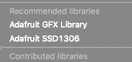

## Overview

The component **LCD** supports monochrome OLED displays with a resolution of 128*64 pixel driven by a SSD1306 driver. The display is not soldered to the board, but there is a four pin connector for an OLED display. The right image shows the component with connected display.

!!! example
    There are four example projects for the Arduino IDE which could be downloaded: 
    **OLED_1.ino** ([download here](../../source/esp32/OLED_1/OLED_1.ino)), 
    **Temp-OLED.ino** ([download here](../../source/esp32/Temp-OLED/Temp-OLED.zip)), the game 
    **Flappy Bird** ([download here](../../source/esp32/Flappy/Flappy.zip)), and the game
    **Pong** ([download here](../../source/esp32/Pong/Pong.zip)).
    

| connector | OLED |
| --- | --- | 
|  |   |


## Activating the component

The component has a dip switch *SW309*, which has to be activated in order to use the component. The component is connected to the following ports:

Function|SWITCH|IO port|Conflicts with|Remarks|
|------------------|----------|----------|----------|----------|
|SCL|1|4|**Gyro**, SW310-4, SCL/SCLK; **Camera**, SW402-1, RCK/RCKL; **SD Card**, SW200-1, CN212 - PIN 6; **Grove I2C**, SW203-2, I2C - SCL|I2C Pull-up by SW308
|SDA|2|19|**RFID**, SW310-3, MISO; **Gyro**, SW310-3, SDA/SDI; **TFT**, SW314-1, MSIO; **mikroBus**, SW405-2, MISO; **Unit-Bus**, SW200-2, CN212 - PIN 5; **Grove I2C**, SW203-1, I2C- SDA|I2C Pull-up by SW307

## Using the component

!!! Info
    **Required libraries**

    In order to use the component you need two libraries: Adafruit SSD1306 and Adafruit GFX library. The latest version of the Adafruit SSD1306 library could be downloaded from the [GitHub repository](https://github.com/adafruit/Adafruit_SSD1306). Additionally you could [download](../../source/esp32/OLED_1/Adafruit_SSD1306-master.zip) a tested version.
    After the download it's necessary to add both libraries to your Arduino IDE. Open *Sketch > Include Library > Add .ZIP Library ...* and select the downloaded archive. Do it for both libraries.

    After a successful installation the menu *Sketch > Include Library* should contain an entry *Adafruit GFX library* and *Adafruit SSD 1306** in the category *Recommended libraries*.

    


### Import the necessary libraries

!!! Caution
    It's important that you use the *"*-sign for including the *Adafruit_SSD1306* library. With the quotation marks the enviroment searches first in the local directory for this library. Here it's important that you put a patched version of this library in your working directory of the sketch. You need [Adafruit_SSD1306.h](../../source/esp32/OLED_1/Adafruit_SSD1306.h) and  [Adafruit_SSD1306.cpp](../../source/esp32/OLED_1/Adafruit_SSD1306.cpp).

```c
#include "Adafruit_SSD1306.h"
```

You need both libraries (Adafruit_SSD1306, Adafruit GFX) for using this sample codes. In case of compilation error you should check whether you have added both libraries to your Arduino development environment. The *Adafruit GFX* library is used from *Adafruit_SSD1306*.

### Setup the display

The first step is to create an instance of the class *Adafruit_SSD1306* in order to work with the display.

```c
#define OLED_RESET 4
Adafruit_SSD1306 display(OLED_RESET);
```

Open the display on the I2C addr 0x3D (for the 128x64).

```c
void setup()   {
  Serial.begin(9600);
  display.begin(SSD1306_SWITCHCAPVCC, 0x3C);
}
```

!!! note
     The line *Serial.begin(9600)* is only for debugging purposes. You could remove this line if you don't need outputs in the Serial console.

### Draw a Pixel

```c
display.clearDisplay();
display.drawPixel(10, 10, WHITE);
```

### Draw many lines

```c
void testdrawline() {
  for (int16_t i=0; i<display.width(); i+=4) {
    display.drawLine(0, 0, i, display.height()-1, WHITE);
    display.display();
    delay(1);
  }
  for (int16_t i=0; i<display.height(); i+=4) {
    display.drawLine(0, 0, display.width()-1, i, WHITE);
    display.display();
    delay(1);
  }
  delay(250);

  display.clearDisplay();
  for (int16_t i=0; i<display.width(); i+=4) {
    display.drawLine(0, display.height()-1, i, 0, WHITE);
    display.display();
    delay(1);
  }
  for (int16_t i=display.height()-1; i>=0; i-=4) {
    display.drawLine(0, display.height()-1, display.width()-1, i, WHITE);
    display.display();
    delay(1);
  }
  delay(250);

  display.clearDisplay();
  for (int16_t i=display.width()-1; i>=0; i-=4) {
    display.drawLine(display.width()-1, display.height()-1, i, 0, WHITE);
    display.display();
    delay(1);
  }
  for (int16_t i=display.height()-1; i>=0; i-=4) {
    display.drawLine(display.width()-1, display.height()-1, 0, i, WHITE);
    display.display();
    delay(1);
  }
  delay(250);

  display.clearDisplay();
  for (int16_t i=0; i<display.height(); i+=4) {
    display.drawLine(display.width()-1, 0, 0, i, WHITE);
    display.display();
    delay(1);
  }
  for (int16_t i=0; i<display.width(); i+=4) {
    display.drawLine(display.width()-1, 0, i, display.height()-1, WHITE);
    display.display();
    delay(1);
  }
  delay(250);
}
```
### Scroll text

```c
void testscrolltext(void) {
  display.setTextSize(2);
  display.setTextColor(WHITE);
  display.setCursor(10,0);
  display.clearDisplay();
  display.println("scroll");
  display.display();
  delay(1);

  display.startscrollright(0x00, 0x0F);
  delay(2000);
  display.stopscroll();
  delay(1000);
  display.startscrollleft(0x00, 0x0F);
  delay(2000);
  display.stopscroll();
  delay(1000);
  display.startscrolldiagright(0x00, 0x07);
  delay(2000);
  display.startscrolldiagleft(0x00, 0x07);
  delay(2000);
  display.stopscroll();
}
```
### Text display tests

```c
display.setTextSize(1);
display.setTextColor(WHITE);
display.setCursor(0,0);
display.println("Hello, world!");
display.setTextColor(BLACK, WHITE); // 'inverted' text
display.println(3.141592);
display.setTextSize(2);
display.setTextColor(WHITE);
display.print("0x"); display.println(0xDEADBEEF, HEX);
display.display();
delay(2000);
display.clearDisplay();
```

### Invert the display

```c
display.invertDisplay(true);
delay(1000);
display.invertDisplay(false);
delay(1000);
display.clearDisplay();
```

## Sample project

A sample project for the Arduino IDE is provided in **OLED_1.ino** ([download here](../../source/esp32/OLED_1/OLED_1.ino)). The following image shows the OLED output of this sample project:

| OLED_1.ino | example |
| --- | --- | 
|  | showing output |

## Create your own picture

Here a short summary how to show your logo at the display.  
Procedure with GIMP and Notepad++:  

Open image with GIMP  
Crop the image to the content  
Scale image to 128 pixels wide (and LINEAR)  
Export file as file type xbm (X-BitMap image)  
Edit "xbm" file with Notepad ++  
Change variable in third line to: "static unsigned char"  
Save file as "images.h"  

A sample project for the Arduino IDE is provided in **Temp-OLED.ino** ([download here](../../source/esp32/OLED_1/Temp-OLED.zip)). The following image shows the OLED output of this sample project:

| Temp-OLED.ino | example |
| --- | --- | 
|  | showing logo of MakerFactory |

## Flappy Bird
An interesting project for the Arduino IDE is the game **Flappy Bird** ([download here](../../source/esp32/Flappy/Flappy.zip)).

## Pong
Another interesting project for the Arduino IDE is the game **Pong** ([download here](../../source/esp32/Pong/Pong.zip)).

