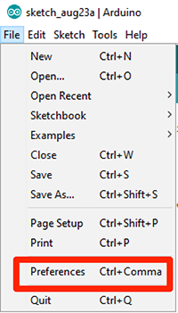

# Programming the ESP32

After a successful [installation](../install) of the Arduino IDE it's necessary to install the ESP32 as development board inside the Arduino IDE. For this you have to do the following two steps:

1. Register a new board manager
2. Install the extension for ESP32

!!! note
    The communication between the host computer and the development board is done by USB. The used USB chipset is a *Silicon Labs CP210x*. It should be automatically recognized by the operation system. If there is no automatic recognition install the driver manually. The link to the driver page is https://www.silabs.com/products/development-tools/software/usb-to-uart-bridge-vcp-drivers

## Register a new board manager

Start the Arduino IDE, open the Preferences window with *File > Preferences* in the menu bar.



The Preferences window has to tabs:

+ *Settings*
+ *Network*


It's not necessary to change setting inside the *Network* tab. But a change in the *Settings* tab is necessary. Add an entry to the *Additional Boards Manager URLs*:


You could directly paste the following url into the input field or open the seperate window:

```
https://dl.espressif.com/dl/package_esp32_index.json
```


## Install the extension for ESP32

No you could install the development extension for the ESP32 into the Arduino IDE.


tet


tet


