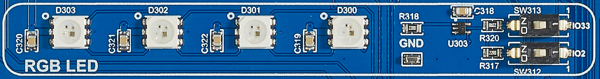
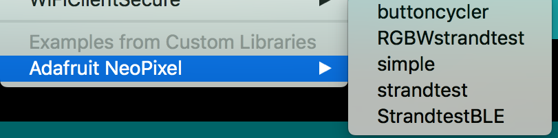

# RGB LED strip

The board has **four** WS2813 RGB LEDs. The LEDs are connected to each other and therefore they could be handled like an LED strip.

The four LEDs are labeled on the board. The first LED in the strip is the LED **D300** near by the switches.

|Label on the board|LED number|
|------------------|:----------:|
|D300|0|
|D301|1|
|D302|2|
|D303|3|

## Hardware activation of the RGB LED strip

!!! Caution
    The LEDs are connected to **two** GPIO-Pins. In order to control the LEDs you have to active one connection and have to deactive the other connection. With the switch **SW313** you could active the connection to **PIN 33** of the ESP32. With **SW312** you could active the connection to **PIN 2** of the ESP32.

Active the RGB LED with **SW313** or **SW312** in the RGB component on the board.

## Preparing the IDE for using the LED strip

The LED strip could be programmed by using the [Adafruit Neopixel Library](https://github.com/adafruit/Adafruit_NeoPixel). This libray have to be installed in your Arduino IDE. The following steps are necessary:

1. Download the latest version of the Library from here [https://github.com/adafruit/Adafruit_NeoPixel/archive/master.zip](https://github.com/adafruit/Adafruit_NeoPixel/archive/master.zip)
2. Extract the the downloaded *master.zip* and rename the folder to *Adafruit_Neopixel*
3. Copy the complete folder to the libraries directory of your Arduino IDE.

!!! Info
    The library order is named *libraries* and could be found in Windows under **XXXXX** and in Mac OS X in *Documents/Arduino/libraries* in the user directory.

Now restart your Arduino IDE.
After a successful installation the examples of the library should occur in *File > Examples > Adafruit Neopixel*

## Programming the LED strip
