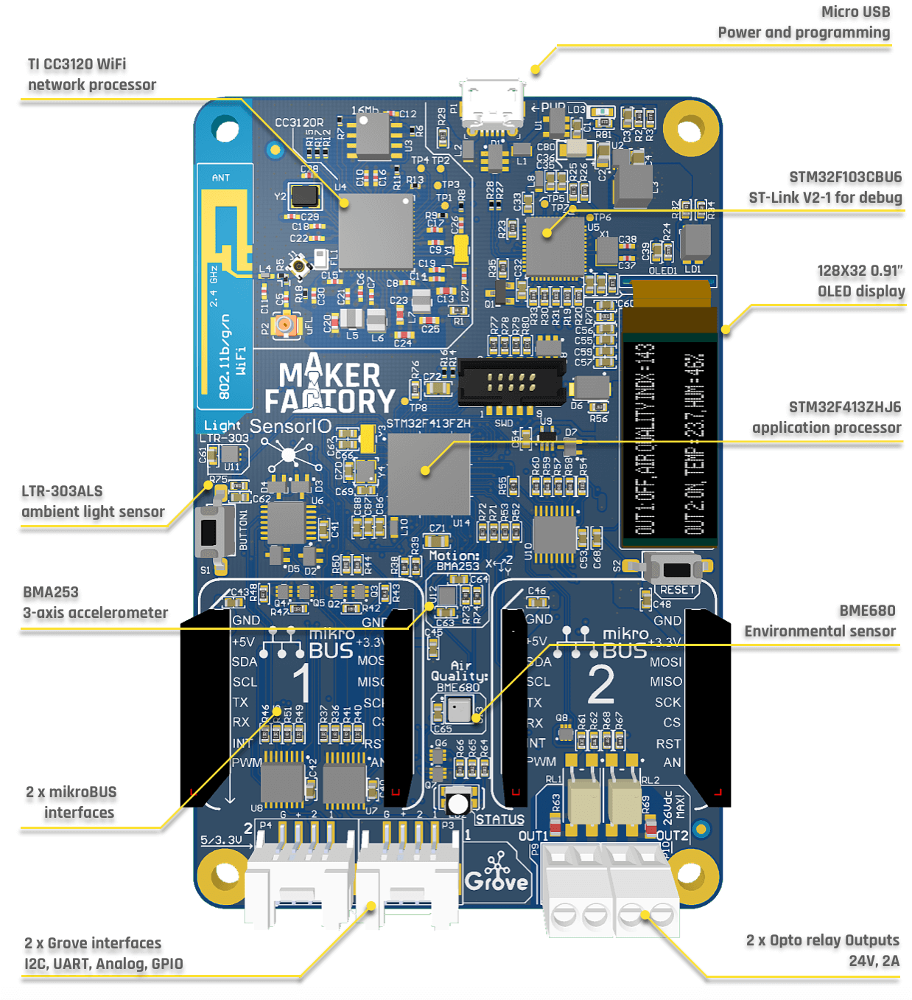
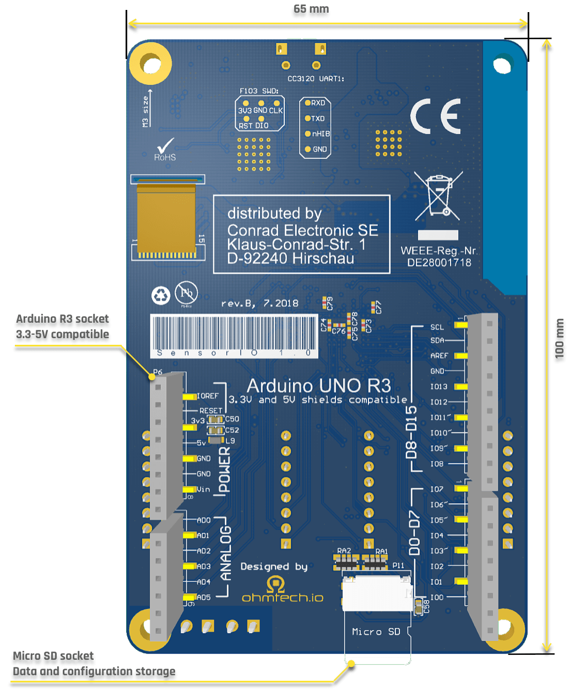
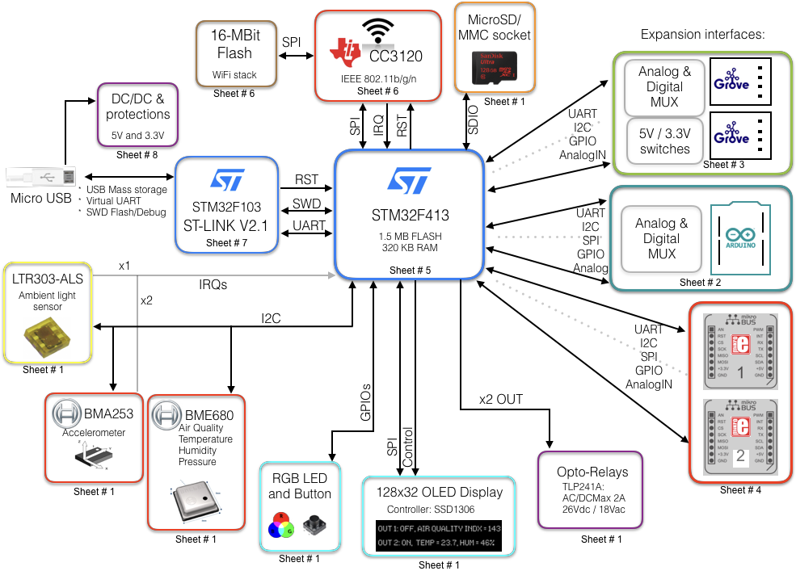

#Overview

*SensorIO* is a powerful and versatile *ARM Cortex&reg;-M4*, [*mbed&trade;*](https://www.mbed.com)-Enabled Internet-of-Things hardware development kit.

Its broad set of features makes it a versatile prototyping and development board for *Wi-Fi&trade;* connected products:

In order to maximize the flexibility of use for different applications, all the expansion interfaces have software-configurable support for 3.3V and 5V boards, bringing compatibility for more than 500+ different expansion boards available in the market from different manufacturers.

##Features 

This is an overview of the main components and features:

* **STM32F413ZH** MCU, *ARM Cortex&trade;-M4*, 1.5 Mbytes of Flash memory, 320 Kbytes of RAM
* On-board WiFi: **CC3120R** *SimpleLink®* 
Wi-Fi 802.11b/g/n 
* 128x32 0.91’’ OLED display 
* *LiteOn* ambient light sensor
* *Bosch* 3-axis accelerometer with motion triggered interrups
* *Bosch* Environmental sensor (temperature, humidity, barometric pressure, VOC air quality) 
* 2x opto-relays output (2A/24Vac)
* 2x *MikroBUS&trade;* sockets
* *Arduino&trade; R3* socket with 3.3V & 5V support on I/Os and Analog Inputs
* 2x Grove&trade; connectors 
	- Software programable individual 3.3V / 5V switches
	- Each connector provides software configurable UART, I2C, PWM, GPIO and Analog interfacing
* Onboard **ST-Link&trade;-V2.1** debugger
* Micro SD/MMC flash memory socket (datalogging, storing credentials)
* User & reset buttons, RGB color LED
* USB functions:
	- Power
	- Debugging port
	- Virtual Serial COMM
	- Mass storage programming (drag & drop)

!!! todo
	Add total interfaces counts

##Block Diagram

##Limitations

!!! info "foo"
	bar

