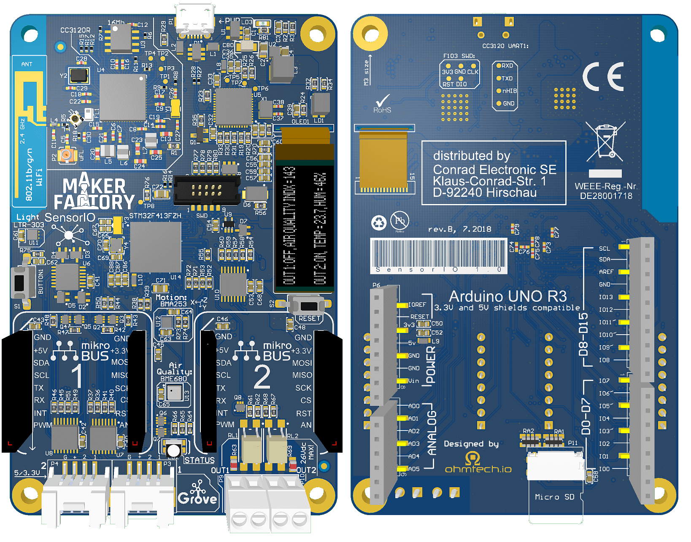

# SensorIO: IoT development Kit

##Introduction

*SensorIO* is powerful and versatile *ARM Cortex&reg;-M4*, [*mbed&trade;*](https://www.mbed.com)-Enabled Internet-of-Things development board targeted to the prototyping and development of connected applications.

Its broad set of features makes it a versatile prototyping and development plaftorm for *Wi-Fi&trade;* connected products.

It was designed with flexibility in mind, and unlike any other development board on the market, *SensorIO* provides full support for [Arduino R3](https://store.arduino.cc/other-shields/shields) shields, [Seedstudio's Grove](https://www.seeedstudio.com/category/Grove-c-1003.html) modules and [MikroBUS Click](https://www.mikroe.com/click) expansion boards. 

### Documentation structure
This guide will show you the capabilities of the board and walk you through the basic steps needed to create a connected device.

The guide is broken-down in 3 parts for ease of use:

* [**Hardware documentation**](/development-boards/sensorio/hardware-overview) details the different functional blocks and helps the users to understand the functionalities of the expansion interfaces, how to configure the software-controlled multiplexers, list all the peripherals exposed and pinouts and provides some technical specifications.
* [**Getting Started**](/development-boards/sensorio/getting-started): if you are anxious and can't wait to start developing, here you will find a quick overview of the out-of-the-box application and will get you up-to-speed with the *SensorIO* development workflow.
* [**Tools**](/development-boards/sensorio/tools): This section covers the software tooling setup, covering the *mbed-cli*, *GCC* installation, obtaing the code and a short introduction to professional debugging with *GDB*.

!!! tip "Firmware flexibility"
	Note that, even though the board is [*mbed&trade;*](https://www.mbed.com)-Enabled, thus providing a quick and powerful firmware development platform and ecosystem, the onboard *ST-Link&trade;-V2.1* interface can be also used to flash and debug firmware based on different RTOS' or bare-metal applications (i.e. [*FreeRTOS&reg;*](https://www.freertos.org/FreeRTOS-Plus/index.shtml) + [STMicro SDK](https://www.st.com/en/development-tools/stm32-software-development-tools.html)).

