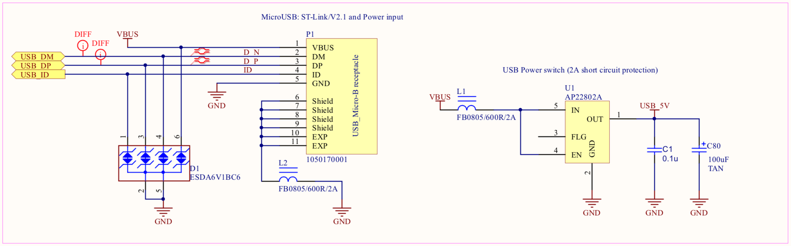
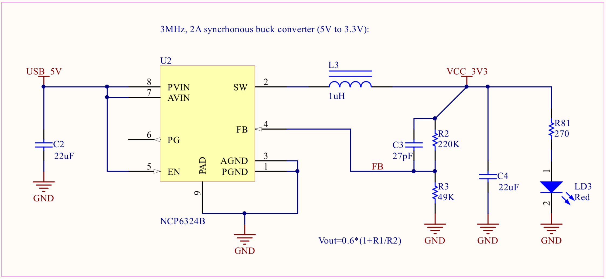
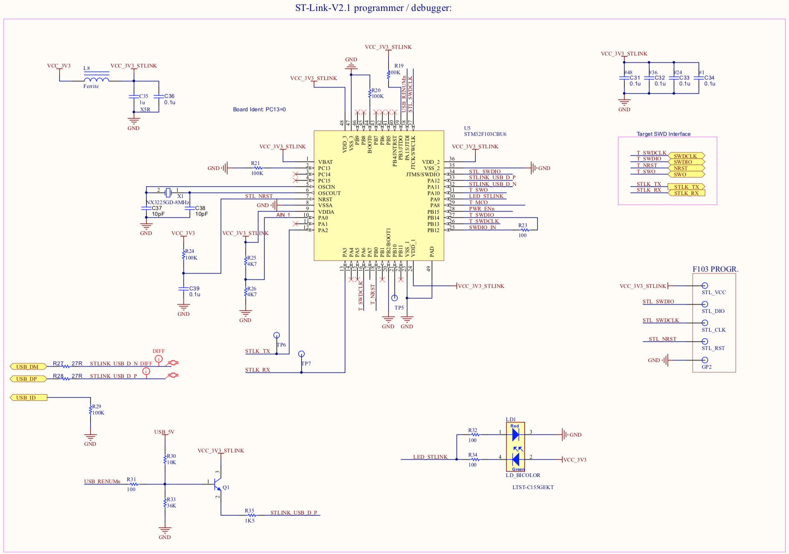

#Circuit Schematics

The full *SensorIO* design Schematics can be found <a href="../assets/SensorIO-revBETA-Schematics.pdf" target="_blank">here</a>, and as a quick reference, some of the relevant sections are detailed below:

## Power supply

!!! info "Power input"
	The primary power source during development is the USB Micro B connector
The figure below shows the connections for USB connector (P1), ESD protection diodes (D1) and the [AP22802A](https://www.diodes.com/assets/Datasheets/AP22802.pdf) load switch, which provides an over-load current protection: when the current reaches 2A, limits the current to 1A until the short-circuit state is resolved.



!!! tip "Alternative 5V input"
	If the device needs to be installed in a permanent setup, it is also possible to provide 5V power through any of the the MikroBUS sockets +5V pins.

!!! warning ""
	Please note that in case this pins are used to power the board, the AP22802A protection will be bypassed, therefore care must be taken to avoid damages caused by short circuits.

 

To convert the 5V from to the 3.3V that most of the sub-circuits uses, the board uses the [NCP6324B](http://www.onsemi.com/pub/Collateral/NCP6324-D.PDF) from *On-Semiconductor* (U2).
The NCP6324B is a 3MHz, 2A synchronous buck-converter with high efficiency and low ripple.

The feedback resistors R2 and R3 set the output voltage close to 3.3V. 

The red LED (LD3) indicates when the VCC_3V3 power bus is active.


## ST-Link

The board integrates the *ST-Link/V2-1* from *STMicroelectronics*. This debugger probe is based on the *STM32F103 Cortex&reg;-M3* MCU, running at 72 MHz.

This MCU interfaces directly to the USB connector. It uses an STM proprietary protocol to transfer the SWD/JTAG protocol data, control the Reset/Run state of the target MCU and converts the Virtual Comm Port into the physical UART connected to the target MCU (STLK_TX and STLK_RX lines) which can be used by the application to send logging data or receive commands from the host PC.

The NPN transistor Q1 is used to pull-high the USB_DP line to force a USB re-enumeration after a firmware update.



The bi-color LED (LD1) indicates the state of the ST-Link interface:

!!! note "LD1 status indication:"
	* **Blinking RED**: the first USB enumeration with the PC is taking place
	* **RED**: communication between the PC and ST-LINK/V2 is established (end of
	enumeration)
	* **Blinking GREEN / RED**: data being exchanged between the target and the PC
	* **GREEN**: the last communication has been successful
	* **ORANGE**: ST-LINK/V2 communication with the target has failed.

Please check the [*tools*](../tools) section for more information on how to flash a binary and connect to a GDB client.

## Main MCU

The target MCU uses the [STM32f413ZHJ6](https://www.st.com/en/microcontrollers/stm32f413zh.html) version of this STMicro MCU (UFBGA144 packaging version, 1.5MB Flash, 320KB RAM).
Please check the [board pinout](../pinout) section and the  <a href="../assets/SensorIO-revBETA-Schematics.pdf" target="_blank">SensorIO schematics</a> for a full reference of the exposed I/Os.

### Clocks
The MCU has 2 external crystals used for the reference oscillators:

* Y4 (16 MHz): used as a more precise main clock source (the MCU has a less-precise internal RC oscillator):


* and Y3 (32.768 kHz) which can be used to mantain a real-time clock:


### Analog VREF
The image below shows the connections for the Analog supply and VREF pins used to configure the internal 12-bit ADC:

The LC filter (L10 and C86) attenuates the "digital" noise that can be present in the VCC power rail. VREF+ is attached to the AnalogVCC and decoupled by C87 and C88. With this configuration, the input range for the ADC converter will be [0-3.3V]. 

Please refer to the [expansion interfaces](../interfaces) section for more information on using the analog inputs.
 
## RGB LED

The user status (LD2) is a RGB LED (a Red, a Blue and a Green LEDs packaged together). Each LED should be controlled separately. The 3 control pins are wired to the timer TIM5 CH[1:3] so the brightness can be controlling using PWM (pulse-width modulation). 
	


The example below shows how to use PWM to controll the brightness of the blue LED:

??? example "mbed example: dimming the blue LED"
	```C++
	PwmOut  blueLed(PF_5);	//Port F bit #5
	blueLed.period(1/100f); //Set PWM frequency to 100Hz (1/100 seconds)
    blueLed.write(0.2f);	//Set Duty Cycle to 20%
	```	

## Push-buttons

The board has 2 push-buttons:

* The MCU **Reset** (located next to the OLED display):


* A user-programmable button **(S1)**, wired to PC_13:


The example below shows how configure the button to trigger an interrupt on press:

??? example "mbed example: button interrupt"
	```C++
	InterruptIn button(PC_13);
	DigitalOut greenLed(PF_4);

	void pinInt(){
		greenLed = !greenLed;	//flip the green LED on each button press
	}
	int main(){
	    button.fall(&pinInt);  // attach the pinInt() function to the falling edge
	    while(1){          	   // wait around, interrupts will interrupt this!
	        printf(".");
	        wait(1);
	    }
	}
	```	

!!! tip "Tip: debouncing"
	To detect a button press, remember that the mechanical action usually indroduces some signal bouncing. It's reasonable to add a delay of at least 20ms before taking any action (software debouncing). 

## Wi-Fi

The capture below shows the TI CC3210 Network Processor SoC and it's associated power supply and oscillator components.


The CC3120 is powered by the main 3.3V rail, and integrates 3 internal DC/DC converters to generate the voltages needed for the operation of each SoC section. 
The main oscillator uses an external 40 MHz crystal (Y2) and a 32.768 kHz crystal (Y1) is used for power management and real-time bookkeping.
An external SPI flash memory (MX25R1635FM1IL0, 16Mbit) is used to store the network stack and credentials.

### MCU interface
The interfacing with the target MCU is done through the SPI bus (signals shown below). The interface contains also a "factory restore" pin, which can be used by the target application to restore the factory image.

In order to restore the original flash image, the CC_FACTORY_RESTORE line has to be hold in low state for about 8 seconds after the CC_nRESET is released.

### Flash programming interface

The CC3210 exposes an extra UART that can be used to program the external flash memory. These signals (along with the nHIB line) are exposed on testpoints on the back of the board. For more information on how to use this interface, refer to the [SRU469C](http://www.ti.com/lit/ug/swru469c/swru469c.pdf) application note from TI.


### RF section

The capture below shows the CC3120 RF 50ohm interface.
A bandpass filter centered on 2.45 GHz helps to remove unwanted noise entering the SoC. 


The LC network formed by L4 and C11 perform the impedance match from the PCB antenna to the 50 Ohm required by the SoC. The capture below shows the return loss seen by the CC3210 RF pin. The VSWR is approximately 1.16:1 (-22 dB at the center of the WiFi band).


In case that the board will be installed in a metallic box, or the WiFi range needs to be increased with a directional antenna, the circuit provides the possibility to use an external antenna connected to the u-Fl connector:

In order to route the RF signal to the u-Fl connector instead the PCB antenna, the 0 Ohm resistor R5 needs to be unsoldered and installed in the R4 location.
The small J1 connector is used for testing purposes, the matching test probe MXHQ87WA3000 from *Murata Electronics* can be used for such purposes. When that probe is connected, the connector switches off the output side.

## Solid State Relays

The outputs OUT1 and OUT2, are driven by the opto-isolated "solid-state relay" [TLP241A](https://toshiba.semicon-storage.com/info/docget.jsp?did=14237&prodName=TLP241A) from *Toshiba Semiconductor*. These devices consist of a photo MOSFET optically coupled to an infrared light emitting diode. They are housed in a 4-pin DIP package. 

!!! info "TLP241A output characteristics:"
	* ON-state current: 2 A max. continuous, 6 A pulsed (t=100 mseg, duty=10%)
	* ON-state resistance: 150 mOhm (continuous)
	* Isolation voltage: 5,000 Vrms
	* Maximum DC voltage: 26 V (limited by the varistor)
	* Maximum AC voltage: 20 Vrms (limited by the varistor)

The outputs are mapped to PG_2 (OUT1) and PG_3 (OUT2). The varistors R63 and R69 protect the relays from over-voltages, limiting the maximum operation voltage to 26 Vdc or 20 Vrms for AC signals. The outputs schematic is shown below:


These outputs can be used to control small DC motors (as a small water pump for your plants), AC/DC solenoid valves, or resistive loads (i.e. a termoelectric peltier element). If these outputs want to be used to control high power loads (i.e. a pump or a HVAC system) the ouputs can be used to drive contactors with 12V coils (as the *Schneider Electric* [LC1D12JL](https://www.schneider-electric.com/en/product/LC1D12JL/tesys-d-contactor---3p%283-no%29---ac-3---%3C%3D-440-v-12-a---12-v-dc-coil) for example).

!!! danger "Warning!!!"
	The outputs' maximum voltage is 26 Vdc, DO NOT DIRECTLY CONNECT TO MAINS under any circumstance.	

Here there is an mbed example showing how to control the ouputs:

??? example "mbed example: switching outputs"
	```C++
	DigitalOut relay1(PG_2);
 
	relay1 = 1; //enable output1
	wait(5);
	relay1 = 0; //disable output1
	```	
 

## Display

The display is a *Vishay* [OLED-128O032D-SPP3N00000](https://www.vishay.com/docs/37895/oled128o032dspp3n00000.pdf), a monochrome 0.9 inches graphic display OLED  with a resolution of 128x32 pixels. The display is interfaced to the MCU through the SPI4 bus plus a *Data/#command* and *reset* control lines.


## Memory card interface

The Micro MMC/SD card socket is interfaced to the MCU through the SDIO bus. The interface is configured to use the 4-bit mode. The schematic is shown below:


## SWD debug connector

As an option to using the ST-Link interface to debug and program the target MCU, the *Cortex-M™* 10-pin connector present in the front (SWD) can be used. Debug probes like *Segger's J-Link®* can be attached to this connector if preferred.
The D8 diode array protects the MCU from ESD. 


!!! note "Using the SWD connector"
	Please note that, as the SWD lines are directly shared with the ST-Link interface, if the external debugger is used, the ST-Link application shouldn't be initialized or both debuggers will compete for the SWD lines. In general, it's sufficient to not initialize the ST-Link software on the host side (OpenOCD or ST-Util). In case this situation arises, just re-connect the USB cable to fix it.
