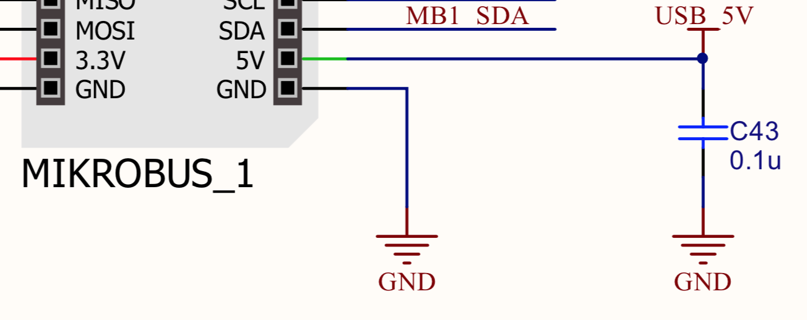

#Circuit Schematics

The full *SensorIO* design Schematics can be found <a href="../assets/SensorIO-revBETA-Schematics.pdf" target="_blank">here</a>, and as a quick reference, some of the relevant sections are detailed below:

## Power supply

!!! info "Power input"
	The primary power source during development is the USB Micro B connector
The figure below shows the connections for USB connector (P1), ESD protection diodes (D1) and the [AP22802A](https://www.diodes.com/assets/Datasheets/AP22802.pdf) load switch which provides an over-load current protection: when the current reaches 2A, limits the current to 1A until the short-circuit state is solved.

!!! tip "Alternative 5V input"
	If the device needs to be installed in a permanent setup, it is also possible to provide 5V power through any of the the MikroBUS sockets +5V pins.

!!! warning ""
	Please note that in case this pins are used to power the board, the AP22802A protection will be bypassed, therefore care must be taken to avoid damages caused by short circuits.

<!--  {img-center} -->
 

<!-- !!! to-do: how can we style the images? I just want to scale and center... -->

To convert the 5V from to the 3.3V that most of the sub-circuits uses, the board uses the [NCP6324B](http://www.onsemi.com/pub/Collateral/NCP6324-D.PDF) from *On-Semiconductor* (U2).
The NCP6324B is a 3 MHz, 2 A synchronous buck-converter with high efficiency and low ripple.

The feedback resistors R2 and R3 set the output voltage close to 3.3V. 

The RED LED (LD3) indicates when the VCC_3V3 power bus is active.

## ST-Link

The board integrates the *ST-Link/V2-1* from *STMicroelectronics*. This debugger/programmer is based on the *STM32F103 Cortex&reg;-M3* MCU, running at 72 MHz.

This MCU interfaces directly to the USB connector. It uses an STM proprietary protocol to transfer the SWD/JTAG protocol data, control the Reset/Run state of the target MCU and converts the Virtual Comm Port into the physical UART connected to the target MCU (STLK_TX and STLK_RX lines) which can be used by the application to send logging data or receive commands from the host PC.

The bi-color LED (LD1) indicates the state of the ST-Link interface:

!!! note "LD1 status:"
	* Blinking RED: the first USB enumeration with the PC is taking place
	* RED: communication between the PC and ST-LINK/V2 is established (end of
	enumeration)
	* Blinking GREEN / RED: data being exchanged between the target and the PC
	* GREEN: the last communication has been successful
	* ORANGE: ST-LINK/V2 communication with the target has failed.

Please check the [*tools*](../tools) section for more information on how to flash a binary and connect with a GDB client.

## Wi-Fi

## Solid State Relays

## RGB LED & Buttons

## Main MCU

## 