# Assembling the mechanical parts
The following illustrations illustrate the mechanical assembly. 

!!! Caution
    When tightening the plastic screws, make sure that they are not screwed too tightly into the plastic and that the plastic holders are not damaged!	If	you	remove	a	screw	from	a	plastic	part	and	then	screw	it	in	again,	first	turn	the	screw	anticlockwise	until	you	notice	that	the	screw	"engages".	At	this	point the screw is "engaged" in the existing thread. The screw can then be easily screwed into the thread that has already been created during the first	screwing	in.	If	the	self-tapping	plastic	screw	is	screwed	in	without	using	this	method,	a	new	thread	may	occur.	This	weakens	the	material	and	the	tensile strength as well as the hold are no longer guaranteed.

## Mounting servos
Mount the servos as shown in the following illustrations. You will need 3 pairs of left and 3 pairs of right legs. Most aluminium parts have a slightly rounded side due to the manufacturing process (punching process). You can use the parts in both directions during assembly. The nicer side should point forward in the direction of travel. The rounded side of the top and bottom plates should point in the same direction (top or bottom).
**Requiered tool:**1x PH2 Cross Screwdriver The screws are packed in plastic bags in the kit. Figure 19 shows the type of screws used for servo mounting. A total of 6x legs must be assembled (3 left and 3 right).

Figure 20 shows a leg of the Robobug. The leg elements are called "Coxa", "Femur" and "Tibia".

Place the servo in the plastic U-angle and the aluminium leg thereon (pay attention to the left and right leg and the round edge). The servo cable is pushed through the oval opening in the U-angle. Screw the leg together with four plastic screws. When screwing the parts together, align them so that they are centred in the U-angle, the aluminium legs lie against the servo and ensure that nothing is strained or warped. If necessary, loosen the screws a little to relax the mechanics and then carefully tighten the screws crosswise.

The Coxa servo and femur servo holder must be mounted 6 times (3 left and 3 right). First insert a servo into the holder and screw it on. Only then is the second servo plugged in and screwed in. The servo cable of the Coxa servo is inserted through the round opening at the top and the servo cable for the femur servo is inserted through the large oval opening as with the U-angle mounting. Screw the servos together with four plastic screws. When screwing the servos together, align them so that they are centred in the plastic holder and are not tensed. If necessary, loosen the screws a little to release the mechanical tension and then carefully tighten the screws crosswise.
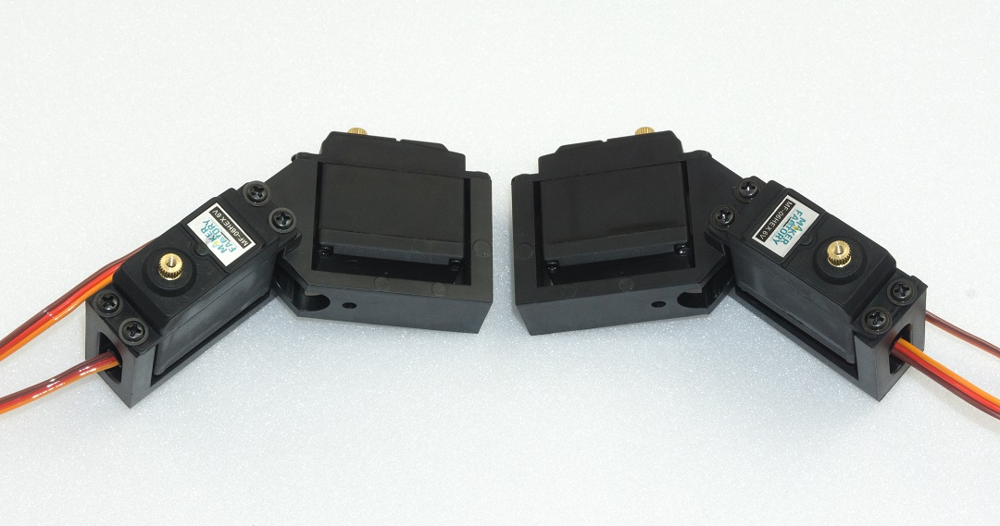

## Mounting of bearings
**Required tool:** 10 mm hexagon socket (from a socket wrench set) or comparable tool as a tool for mounting the bearings Push the bearings into the aluminium parts as shown in the following illustrations. Here a hexagon socket wrench or a comparable tool can be helpful. Do not use rough force, this can damage the base plate and the ball bearings! Avoid tilting, with some sensing the position can be pressed in without great resistance.   

&rarr; Make	sure	that	the	edge	of	the	bearing	is	flush	with	the	aluminium	part. If a bearing cannot be pressed in, it may be caused by a protruding burr or too much paint. You can easily rework the bore with a knife (e.g., cutter knife	for	wallpaper	or	floors)	or	with	a	file.	If	the	bore	has	become	too	large,	the	bearing	can	be	glued	to	the	flange	of	the	bearing	with	a	small	drop	of	glue (e.g., Uhu® Endfest or comparable). 	The	bearings	may	come	loose	during	final	assembly	due	to	uneven	pressing	of	the	cylindrical	pins	into	the	plastic	holders.	This	is,	however,	not	too	bad, as the pins can easily be pushed back into the intended hole. 	Sticking	should	be	a	last	resort.	The	bearings	clamp	sufficiently	strongly	in	the	holes	for	the	operation	of	the	robot	even	without	glue.
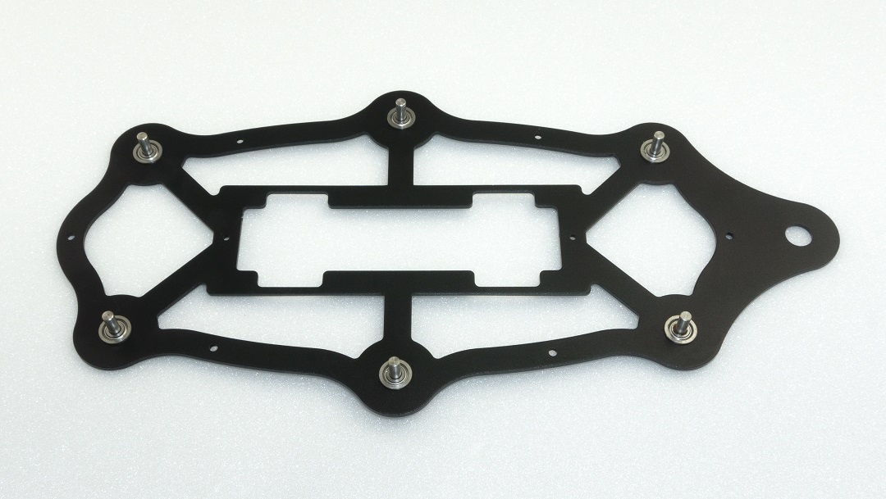

&rarr; Figure 24 shows the bottom plate from above! Figure 25 shows how you can press the bearings into the base plate using the femur aluminium parts as a support. The hexagon wrench must press against the edge of the bearing. Masking the aluminium parts with painter tape protects them from scratching. Other parts that can be found in the hobby workshop can also be used as underlay.    

&rarr; Do not use adhesive tape that cannot be removed without leaving a residue.

The femur counter bearing must be assembled a total of 6 times.
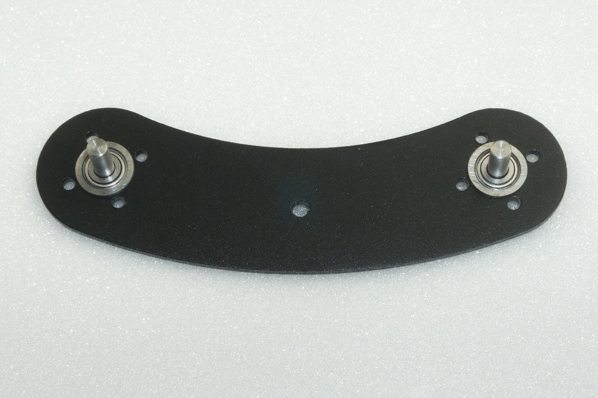 

Figure 27 shows how you can push the bearing into the aluminium part by hand. The bearing should snap into the bore provided with a bold push.

Make	sure	that	the	edge	of	the	bearing	is	flush	with	the	aluminium	part.

##Mounting the servo disks
Mount the servo disks as described in the following illustrations. Use two M2 screws + nut for each servo disk. The other holes remain free! 
!!! Caution
    These screws (all M2) are now already provided with a screw lock.

**Required tool:**   

- PH1 Phillips screwdriver   
- Small	flat	nose	pliers	or	wrench	for	M2	nut	(SW4)  
- Screw locking (medium strength)    

**Mounting the servo discs on the upper plate:**  

&rarr; Figure 29 shows the top plate from above!  

 

&rarr; Figure 30 shows the top plate from below!
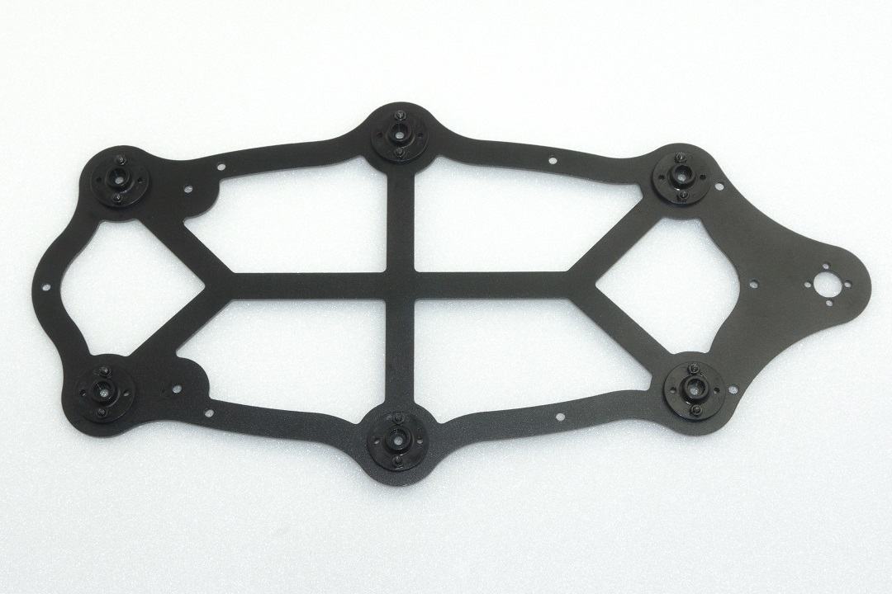 

The femur servo mount must be mounted a total of 6 times.
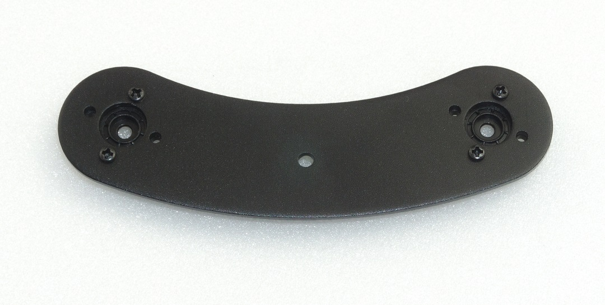 

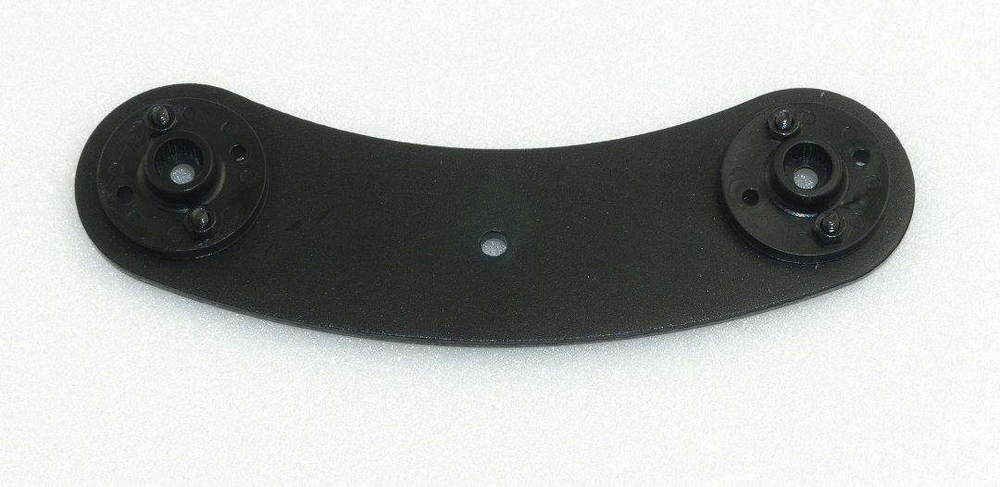 

## Mounting the spacer 
Next, screw together the spacers (30 mm long) for the legs, top and bottom plates as shown in Figure 33. A total of 12 screwed spacers are required. Required tool: 2x SW 5.5mm open-end wrench 
Then	fit	a	screwed	spacer	to	each	femur	counter	bearing.	Insert	the	threaded	side	through	the	counter	bearing	and	fix	it	with	an	M3	nut.	It	is	sufficient	if	the	spacers	are	only tightened by hand. Do not tighten these screws until the assembly is complete. This way you still have the possibility to easily adjust everything during assembly.
 

 

Do the same with the base plate.   
&rarr; Figure 35 shows the bottom plate from above!

## Mounting the servos on the top plate
Mount the servos with the M3 screws (M3 x 6 mm, large head diameter) as shown in Figure 36.    

&rarr;For mounting the servos with the servo discs, always use the M3 x 6 mm screws (servo mounting screws) with the larger 6 mm head is used. The 
 M3 x 6 mm screws with the smaller 5 mm head are used for the spacers!   

 Insert the servos into the teeth of the previously mounted servo disks. Proceed carefully so that the servos do not twist during insertion. If it should happen that a servo has rotated from the middle position during assembly, then bring the servo back to the middle position with the aid of the Hexapod Robot Board and the "ServoCenter" software. This procedure has already been described in Chapter 12.   

 If, due to the teeth of the servo disk or the general mechanical tolerances, you are not yet able to align the legs too precisely, this is not a problem. Adjust the leg as mechanically as possible, as shown in the illustration. An exact calibration is done after the assembly with the help of the software.   

 &rarr; The servo mounting screws (PH2 (M3 x 6 mm, large head diameter) are not yet equipped with a screw lock! Only when the robot has been completely assembled and calibrated can these screws be removed and secured!   

 **Required tool:** PH2 Phillips screwdriver
 

Figure 36 illustrates the Hexapod body viewed from "above". The two front and the two rear legs are installed in such a way that they point outwards at an angle of 45° without twisting the centre position of the servo (centre position). You can orient yourself on the cross-paths in the upper plate at an angle of 45°. The two middle legs (left and right side) are installed straight outwards at an angle of 90° to the body.   

&rarr; Please also refer to Figure 37 on the next page.
 

## Mount bottom plate
Mounting the bottom plate requires some skill. Place the top plate with its back on the table as shown in Figure 38. Push the cylinder pins of the base plate into the plastic holders of the top plate, starting from the front or rear, all the way round. Do not push the pins completely in	the	first	time,	but	repeat	the	working	step	and	press	the	cylinder	pin	only	a	few	millimetres	into	the	plastic	each	time	it	circulates.	This	prevents	the	component	from becoming strained!   

 &rarr; Place an underlay, such as a cardboard box, between the component and the table so that you do not scratch the table with the screw heads! The foam from the packaging for instance is very suitable for this purpose. Do not use force. This can damage the servos, the base plate and the ball bearings!   
 You can set the correct distance between the bearing and the plastic holder using a 2.5 mm Hexagon key. The Hexagon key serves as a distance gauge, see Figure 41. Finally, the upper plate is screwed together with spacers. Use the M3 x 6 screws (small head diameter 5 mm) for this purpose.  

**Required tool:**   

- PH2 Phillips screwdriver  
- Underlay e.g., cardboard box;   

&rarr; Figure 38 shows the bottom side of the robot!   
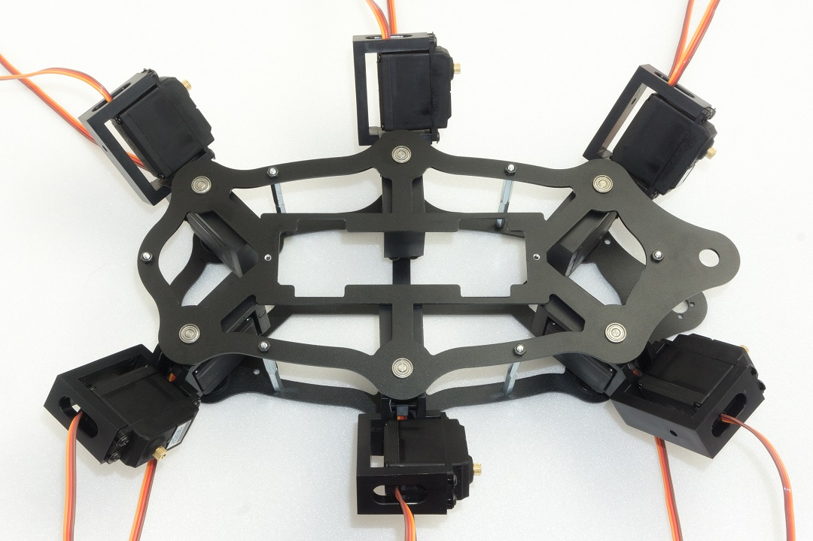 

&rarr; Figure 39 shows the top side of the robot!   

Figure	40	shows	how	the	dowel	pins	are	only	slightly	pressed	in	to	fix	them in the plastic. Only	when	all	the	dowel	pins	have	been	fixed	in	the	holes	of	the	plastic	holders are they pressed in at a distance (2.5 mm). To achieve the correct distance, place the Hexagon key between the bearing and the plastic holder and press the cylinder pins into the plastic holder with moderate force. If a cylindrical pin has been pressed in too far by mistake, you can correct this with a wide slotted screwdriver by gently levering it out. Make sure, however, that the aluminium parts are not damaged (scratched). After all bearings have been pressed in and adjusted to the correct distance, screw them together with the spacers. Figure 41 shows how to set the correct distance using the 2.5 mm hexagon wrench as the spacer.
 
 

## Mounting the Receiver and Hexapod Robot Board
Now	the	radio	receiver	for	the	gamepad	is	connected	to	the	robot	board	and	mounted.	The	receiver	is	fixed	to	the	underside	of	the	robot	board	with	the	supplied	double-sided adhesive tape.   

&rarr; The	receiver	and	the	connection	cable	must	first	be	connected	to	each	other.	Connect	the	wide	receiver	plug	to	the	receiver.	When	connecting	the	receiver to the robot board, make sure that the polarity of the connectors is correct.   

**Required tool:**   

- Scissors  
- PH2 Phillips screwdriver  
- Open-end wrench SW 5.5 mm   

Plug the cable into the receiver as shown in Figure 42. The "POWER" and "RX" labels point upwards in the illustration. Use the same colour sequence as shown in the illustration.

Shorten the double-sided adhesive tape to approx. 25 mm using scissors. Then	peel	off	one	side	of	the	protective	film	of	the	adhesive	tape	and	stick	this	side	onto the robot board.

Now	peel	off	the	other	side	of	the	protective	film	and	affix	the	receiver.	Make sure that the housing side with the two red LEDs locks with the "thick" contacts (see arrow in the illustration) of the loudspeaker. If the housing protrudes too far into the contacts of the loudspeaker, the housing will press against the contacts of the loudspeaker when mounting the circuit board.
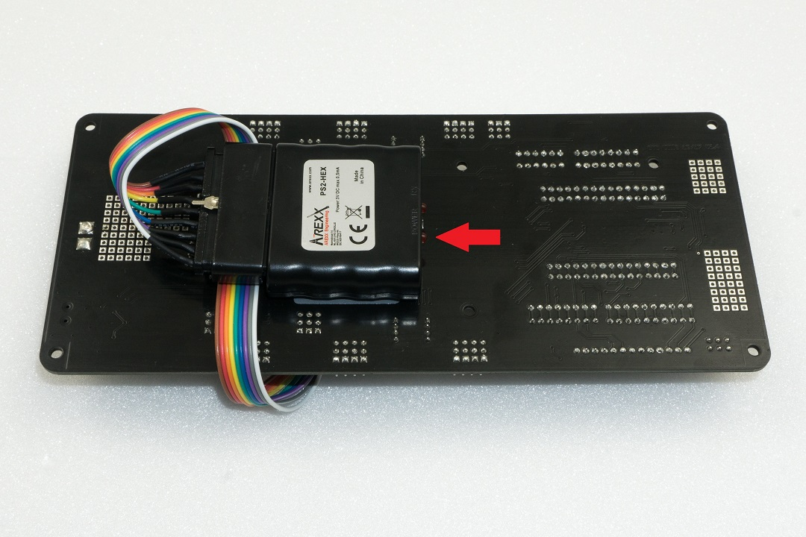
Now connect the cable to the robot board. The colours are combined in the plugs to 3 wires each. From left (MicroSD card holder position) to right (battery plug position): White, grey, purple -> White points to outer edge of board Blue, green, yellow -> Blue points to the outer edge of the board Orange, red brown -> Orange points to the outer edge of the board.   

&rarr; Figure 45b shows a detail enlargement of Figure 45.

Now mount the robot board with the four 15 mm spacers. The threaded side of each spacer is inserted into the top plate and fastened with an M3 nut.    

&rarr; Do not tighten the M3 nuts too tightly as this will allow you to readjust them easily to mount the PCB without tension. Only when the board has been fixed	to	the	spacers	with	four	screws	M3	x	6	mm	(small	head	diameter	5	mm),	tighten	the	M3	nuts.	In	this	way	you	can	align	the	board	cleanly.

Figure 48 shows the pin assignment of the receiver (left) and the pin assignment of the robot board (right).

## Mounting the legs
Try to mount the legs the as well as you can. Minor deviations do not play a role and cannot be avoided by the mechanical tolerances and by the coarse teeth of the servo disks. &rarr; The legs will be exactly adjusted later by software!  
Figure	48	(see	also	Figure	20)	shows	the	basic	configuration	of	a	Hexapod	leg.	It	should be noted that the thigh (femur) is aligned parallel to the ground ("ground" in the picture). The pivot point of the shin ("tibia") is parallel to the body ("body"). When the leg is fully adjusted, there is a 90° angle between the femur and the tibia. The arrangement between "body" and "femur" is parallel in one line. The difference in height does not play a role here. Figure 49 (see also Figure 17) once again shows the pin assignment of the robot board for the leg servos. The following list shows wherein each servo is connected. Basically, the connection sequence "COXA", "FEMUR", "TIBA" always applies; then follows the plug contact "SAx", which remains free!    

Now connect the servos to the board. With the "ServoCenter" programme you can always check during assembly whether the leg is still in the basic position.
 

&rarr; After	mounting	each	leg,	use	the	"ServoCenter"	programme	to	check	whether	the	leg	is	in	the	basic	configuration	or	whether	an	error	has	crept	in	due	to turning the servo while mounting!   
    
|  |  |
| :---|:---|
| RR (right rear)| LR (left rear) |
| S0 = Coxa | S9 = Coxa|
| S1 = Femur| S10 = Femur|
| S2 = Tibia| S11 = Tibia|
| RM (right middle) | LM (left middle)  |
| S3 = Coxa | S12 = Coxa|
| S4 = Femur| S13 = Femur|
| S5 = Tibia| S14 = Tibia|
| RF (right front) | LF (left front)  |
| S6 = Coxa | S15 = Coxa|
| S7 = Femur| S16 = Femur|
| S8 = Tibia| S17 = Tibia|   
   
Coxa = hip   
Femur = thigh   
Tibia = leg or shine-bone   

First mount the thighs (“femur”) as shown in Figure 50. Screw the thighs to the servos (M3	x	6	mm	screws,	large	head	diameter	6	mm).	Then	assemble	the	legs	“tibia”	and	fix	them with the M3 x 6 screws (large head diameter 6 mm). It is helpful to lift the robot with the help of a cardboard box. If you have a 3D printer, you can also print out the robot stand. The	files	can	be	found	free	of	charge	at	www.conrad.com on the respective product website.    
&rarr; After the robot is completely assembled and adjusted, you should provide the screws, which connect the servo disk with the servo, with a small drop of screw lock. During operation they will loosen quickly and may get lost!   

**Required tool:**   

- PH2 Phillips screwdriver  
- Open-end wrench SW 5.5 mm

Despite	the	angled	tibia	servos,	"femur"	must	be	parallel	to	the	floor	at	the	end	and	"tibia" parallel to the body. The "femur" and "tibia" make a 90° angle; the servos themselves are still in the middle position! Figure 52 shows the Robobug when all legs are fully assembled and in the home position. Ideally, the red line (Figure 51) would run exactly in the middle of the screw heads. Since the servo disks do not allow this due to the toothing and the mounting tolerance, it may be slightly off the mark with some legs. This is not bad, the exact alignment to the middle will be done later by software.
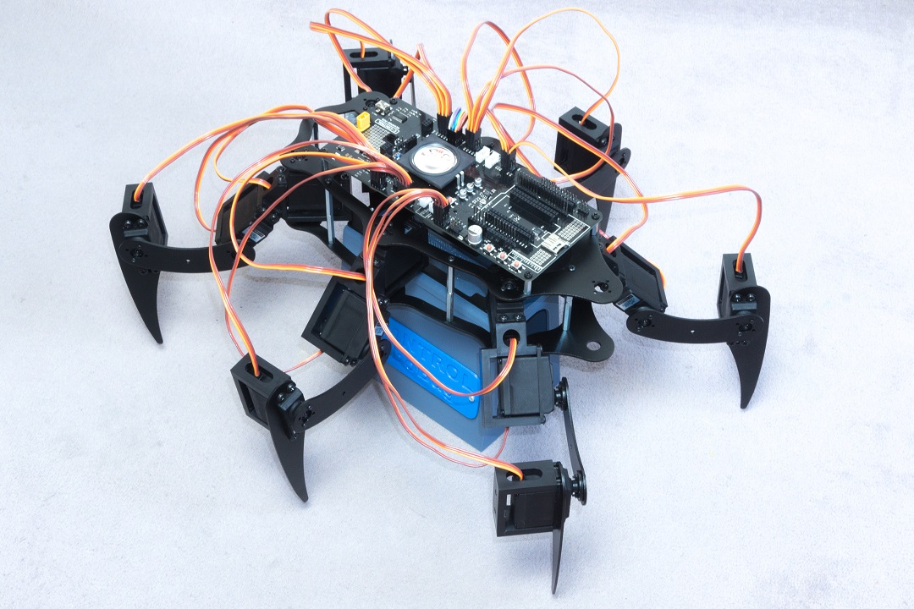

Now mount the counter bearings.   

&rarr;  The U holder has two holes, use the hole facing the cable opening.   
When pressing in the dowel pins, proceed in the same way as when pressing in the dowel pins of the base plate. The distance between the bearing and the plastic part here is 1.5 mm. You can also use an Hexagon key as a distance gauge here. Then screw the spacer on each leg with a M3 x 6 mm screw (small head diameter 
5 mm) as shown in Figure 53.
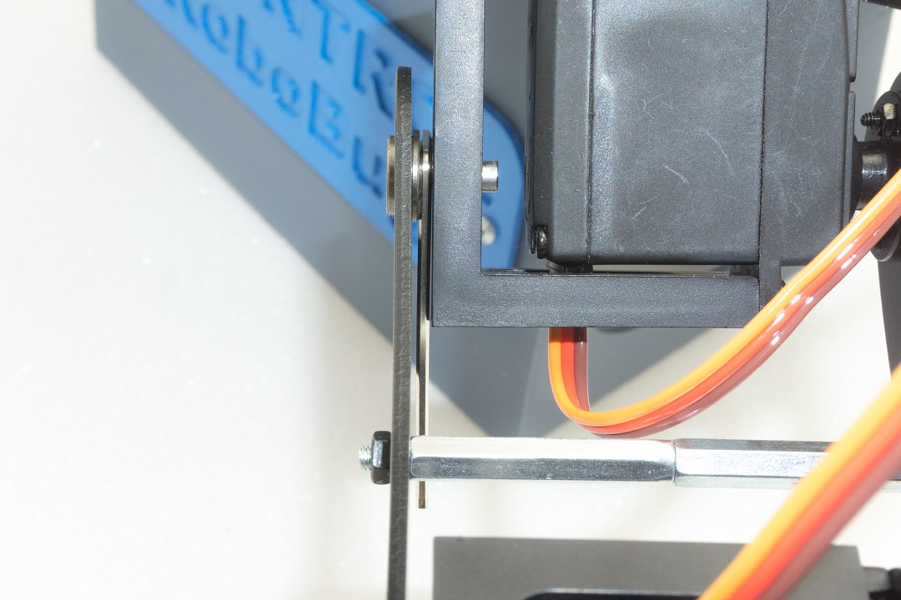
The 1.5 mm hexagon key is placed between the ball bearing and the plastic part and the cylindrical pin is pressed in until it stops. Also,	in	this	case,	press	the	cylindrical	pins	only	alternately	(first	one	side	then	the	other) piece by piece into the plastic so as not to tilt the holder.    

&rarr;  If you hold the robot at an angle, you can hang the Hexagon key over the cylinder pin without it falling down.    
Figure 55 shows the Robobug with the legs fully assembled and in the basic position.

## Laying the cables 
Lay the cables as shown in the illustrations. Use the supplied cable ties for this purpose. After the cable ties have been tightened, cut off the protruding part of the cable tie. A clean cable laying gives the robot a very high-quality appearance!   

&rarr; As	long	as	you	have	not	finished	aligning	the	cables,	you	should	not	tighten	the	cable	ties	too	tightly.	This	way	you	can	make	small	corrections	easily.    

**Required tool:** Electronic side cutter   

 
 
 
 
 
 
 

## Installing the battery
The battery is mounted edgeways with the supplied Velcro fastener as shown in the illustrations. To do this, shorten the Velcro fastener to approx. 25 cm. Tighten the Velcro so	that	the	battery	has	a	firm	grip	on	the	battery	plate	and	cannot	slip	during	operation.   

Then run the cable through the top plate as shown in Figure 64a. Screw the battery retaining plate to the lower plate. Use the screws M4 x 5 mm for this purpose.

In Figure 64b (see also Figure 7) you can see how the battery is plugged into the Robobug. The plug is protected against reverse polarity and cannot therefore be plugged in the wrong way.

## Mounting the rubber feet 
Slide the supplied rubber feet onto the ends of the legs. You can also secure the rubber caps with some glue (e.g., Uhu® All Purpose Glue or similar) so that they are not lost during operation.    

&rarr; The rubber feet not only secure a good grip on the ground, but also ensure that	the	aluminium	legs	do	not	scratch	the	ground	(floor,	table	etc.).  
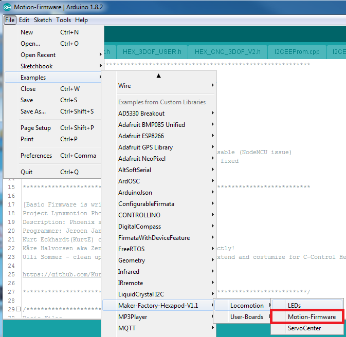

## Setting jumpers
Finally, the two jumpers are plugged in. The jumper for the infrared receiver is plugged on "IR-U"; the jumper J7 is plugged only on one pin.    

&rarr; If you connect jumper J7 to both pins, the gamepad will be deactivated!

