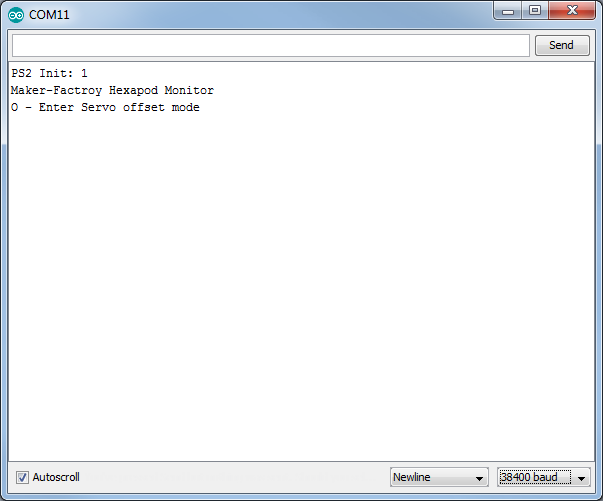

# Calibrate legs
To adjust the legs exactly, use the programme "Terminal" (if you work with the Windows operating system) or alternatively, the Arduino IDE Terminal. The aim now is to adjust the legs into an exact basic configuration. When assembling the mechanics, you will not be able to bring the legs 100% into the basic configuration due to the teeth of the servo disks and the mechanical tolerances. You can use this tool to compensate for these deviations. Figure 69 shows how the basic configuration should look for each leg.

   
**Figure 69**

The fictitious red lines show how to align the leg. The thigh "femur" must be aligned so that it is parallel to the floor.

The tibia is perpendicular to the floor and makes a 90° angle at the thigh. If the robot is placed on a flat surface with a mounting aid as shown in the illustration, the distance between the table and the centre of the M3 cross screws can easily be measured with a ruler. The angle can also be easily checked with a ruler by using it as an angle as shown in the illustration. The ruler stands with the short edge on the table and the long side must coincide with the vertical red line.

Figure 70 shows a ready mounted leg in the basic position. Ideally, the red line would run exactly in the middle of the screw heads. Since the servo disks do not allow this due to the toothing and the mounting tolerance, it may be slightly off the mark on some legs. You can now correct this with the calibration.

 &rarr; **Use a mounting aid:** 
 Our mounting aid is ideal for calibrating the legs. The mounting aid is available as a 3D model for download at www.conrad.com under the product. For printing you need a suitable 3D printer. Alternatively, you can of course also use any other base such as a pot, a sturdy box or similar. It is important that the robot stands stable on it and does not wobble; the legs must not be obstructed in the movement.

   
**Figure 70**

**Calibrating legs with PC**   
If you are using Windows, you can use the "Terminal" program. The programme is located in the "Terminal" folder.

If you are using MAC OS or Linux, you can skip this part and continue with the section "Leg calibration with the Arduino IDE".   

- Start the programme with the file "Terminal.exe" and perform the calibration. Elevate the robot upwards so that the legs can move freely in the air. A stable box can, for example, serve for the elevation.   
- Connect the Hexapod Robot Board (connector "PRG-M") to your computer as already done when installing the firmware.   
- Connect the battery to the Hexapod Robot Board.   
- Start the programme "Terminal.exe".   
- Now select the serial port (same port as for programming). To do this, click on "Select Port". If more than one device is displayed, simply unplug the
motherboard and plug it back into the USB port. The device which then disappeared briefly is the correct one.   
- Select 38400 Baud under "Baud rate".   
- Click on "Connect". The robot appears in the terminal window, as shown in Figure 71.   
- Click on "Servo offset mode" in the upper left corner to enter the calibration mode.  
- The robot will now "wobble" with the servo selected for adjustment.   
- By clicking on "+" and "-" several times, you can adjust the selected servo exactly in small steps.   
- Once you have finished setting the servo, you can click on "Next" to set the next servo until you have set all 18 servos. You can also select a specific leg by clicking on the "Leg RR", "Leg RM", "Leg RF", "Leg LR", "Leg LM" and "Leg LF" buttons.   
- Once all servos have been set, click on "Exit". The programme now asks whether the settings should be saved. Click on "Yes" to save the settings or "No" to discard the settings.   
- With "Clear Terminal" you can delete the contents of the terminal window.   

   
**Figure 71**

**Calibrating legs with the Arduino IDE**   
If you are using a MAC or Linux, you cannot use the "Terminal" programme (only suitable for Windows). However, you can still adjust the legs by using another terminal programme of your choice. The easiest way is to use the Arduino Terminal. You can invoke this in the Arduino IDE. The figure shows the Arduino terminal after the terminal has connected to the robot board. Proceed as follows:    

- Connect the Hexapod Robot Board (connector "PRG-M") to your computer as already done when installing the firmware.   
- Connect the battery to the Hexapod Robot Board.   
- Start the terminal program.   
- If you are using a terminal other than the Arduino terminal, select the serial port (same port as for programming).   
- Select a baud rate of 38400 baud. No LF and CR or "No line encoding" in the Arduino terminal.   
- Connect the terminal to the robot. The robot appears in the terminal window, as shown in Figure 72. Please note: The Arduino terminal connects immediately after opening!   
- Press the "RESET-M" button on the Hexapod Robot Board once. This is not necessary when using the Arduino terminal.   

   
**Figure 72**

The following text appears in the terminal window.   
  PS2 Init: 0   
  Maker Factory   
  Hexapod Monitor   
  O - Enter servo offset mode   

Send an "O" to the robot board by writing "O" in the transmission line and then pressing the Enter key. The robot will now "wiggle" with the chosen servo in the setting.

&rarr; The characters can be written in small or capital letters ("o" as well as "O" is possible). The following message then appears in the terminal:
Serial Cmd Line:o<eol> Find Servo Zeros. $-Exit, +- changes, *-change servo 0-5 Chooses a leg, C-Coxa, F-Femur, T-Tibia Servo: RR Coxa(0)

The following input options are available:   

- With "$" you leave the calibration -> Exit   
- With "+" or "-" you can precisely adjust the selected servo in small steps. The characters must be sent to the Hexapod Robot Board until the leg is correctly adjusted.   
- Use "*" to select the next servo.   
- With a number from 0 to 5 you can select the legs individually.   
  0 = Leg RR (right rear)   
  1 = Leg RM (right middle)   
  2 = Leg RF (right front)   
  3 = Leg LR (left rear)   
  4 = Leg LM (left middle)   
  5 = Leg LF (left front)   

When all servos are set, send a "$" character. The programme will now ask if you want to save the data. Send "y" for save or "n" to discard the settings.

&rarr; You may need to perform this calibration procedure again after some time. The reason for this is that after a certain operating time the servos get a larger gear backlash and the first calibration no longer proves to be ideal.

After the Robobug has been assembled and calibrated, you can unscrew the screws M3 x 6 mm (large head diameter 6 mm) and secure them with a screw lock. These are then screwed in again. Also check all other screws for tightness.
