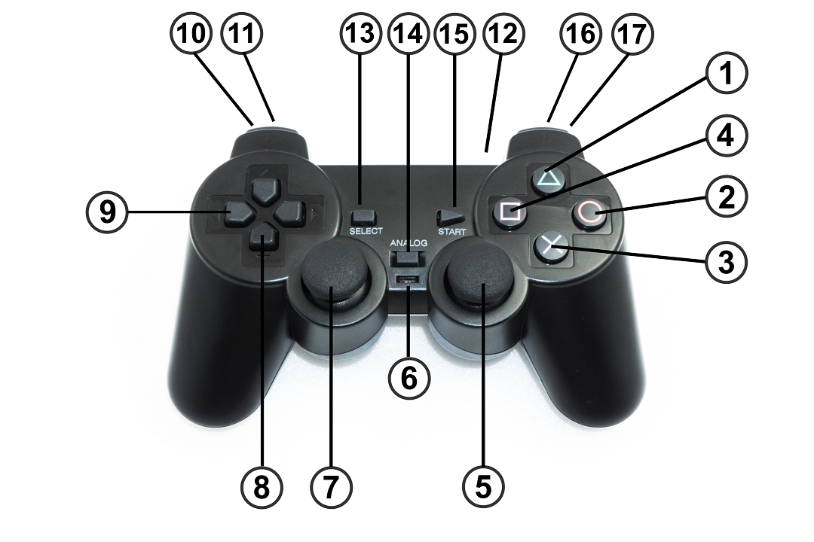

# Controlling with the Gamepad
After you have transferred the "motion firmware" to the Locomotion controller (see chapter 14), you can control the robot with the gamepad. With the included gamepad, all functions of the Locomotion controller are immediately available to you after commissioning and the robot can be moved similar to a remotecontrolled car without you having to create your own programme beforehand.

&rarr; To check the settings comfortably and quickly, it is advantageous to operate the robot with the gamepad. Alternatively, you can also control it directly via a user board. In practice, however, this has turned out to be less convenient for initial commissioning. In addition, you can later intervene in the sequence of your programme with the help of the gamepad when using a user board. It is also possible to read the control commands (joystick values and buttons) from the user board and use them in your own program.

!!! Important
    Make sure that the receiver is connected correctly and that the plugs are not twisted on the pin strips, otherwise the receiver may be damaged! The jumper "J7" must not be plugged in, otherwise the gamepad is deactivated (see chapter 13. l).

**Quick Start:**

- Disconnect the power supply from the Hexapod Robot Board.
- Switch on the gamepad with the switch (6). The two LEDs (12) "Green" and "Red" flash.
- Connect the battery to the Hexapod Robot Board.  The LEDs (12) "Green" and "Red" light up permanently after a few seconds. The transmitter (gamepad) is now connected to the receiver.
- Press the "START" button (15). The robot beeps and the red "USER-LED" on the Hexapod Robot Board lights up permanently.
- Switch on the robot with the key (3). The robot beeps and the blue "LIVE-LED" on the Hexapod Robot Board flashes.
- Let the robot stand up by pressing button (1).
- Use the thumb joystick (7) to move the robot forwards/backwards and left/right. With the thumb joystick (5) you can turn the robot on the spot.

**Detailed description of the gamepad functions:**

1. Make the robot stand up and sit down (toggle function)
2. System reset
3. Switch the robot on/off after the gamepad has been activated with the key (15)
4. Switch on/off balance mode (toggle function)
5. Right Thumb joystick (turn on the spot, turn in rotate and translate mode and change the height of the robot)
6. LED lights green when the connection to the robot has been established
7. Left thumb joystick (forward/backward, in rotate and translate mode forward/backward and lateral movement).
8. D-Pad up/down adjusts the height of the robot (up = higher, down = lower).
9. D-Pad left/right adjusts the running speed (left = slower, right = faster)
10. Upper key = translate mode (toggle function)
11. Lower key = rotate mode (toggle function)
12. On/off switch
13. Select gait (Tripod-6, Tripod-8, Tripple-12, Tripple-16, Ripple-12, Wave-24). Each time the button is pressed again, the gait is shifted through as described in the list.   If the list starts from the beginning (Tripod-6), the Hexapod Robot Board signals this with a different tone sequence.
14. No function
15. Activate gamepad (after this the robot reacts to control commands)
16. Activates double step height (toggle function) 17 Activates double step size (toggle function)

&rarr; All buttons with toggle function (renewed pressing, changes the state) makes the robot board beep in different tone sequence. If you press the key for the first time, the Hexapod Robot Board acknowledges this with a beep and when you press it again (original state) with a tone sequence. This makes it easy to find out what state the robot is in. After the tone sequence has sounded, the original state (start state) is always active.
