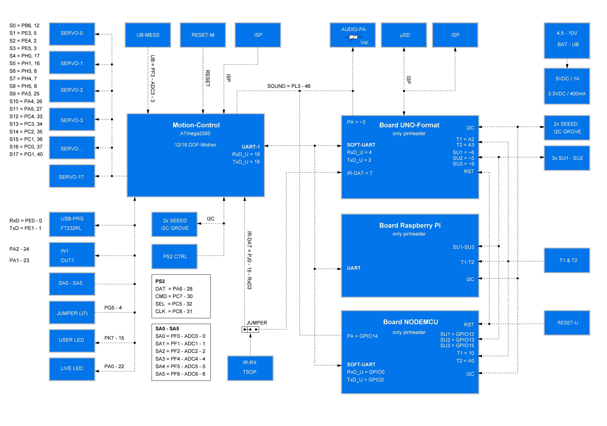

# Demo programs

To use the user boards easily and comfortably, use the Maker-Factory Hexapod library. This library was already installed at the beginning of this manual. The provided examples show the use of the user boards and the functionality of the Arduino Hexapod library. When	using	user	boards	that	are	not	Arduino	compatible	(like	SBC),	look	at	the	file	"Hexapod_Lib.h".	This	file	shows	how	the	communication	between	the	user	board	and	the	locomotion	controller	works.	This	will	serve	you	as	an	example	for	developing	your	own	function	library.	To	do	this,	unpack	the	ZIP	file	"\LibraryDemos\Maker-Factory-Hexapod-Vx.1.zip" from the download bundle and look at the source code of the library in an editor such as Notepad or a development environment of your choice.

!!! Caution
    The supplied examples are designed for "Arduino UNO" and "NodeMCU" boards programmed with the Arduino IDE.

The Arduino examples show how to use the library. These can be found in the Arduino IDE under "Examples\Maker-Factory-Hexapod-Vx.x\...". Take your time to look at all the examples and test them on your Hexapod. Once you have understood the examples, you can start and create your own programmes with them. Take a closer look at the "Hexapod_Lib.h". With some experience you can easily extend it with your own functions.

##Short description of the provided examples for Locomotion  TODO
In the folder "Locomotion" you find the examples for the Locomotion controller (Arduino MEGA2560).

- **LEDs**
Small test programm that alternately flashes the two LEDs (Users and Live).
- **Motion-Firmware**
Firmware of the locomotion controller.
- **ServoCenter**
This program moves the servos to the middle position. As needed for mechanical assembly of the Hexapod robot.

##Brief description of the supplied examples for user boards
In	the	folder	"User-Boards"	you	will	find	the	examples	for	Arduino	UNO	and	NodeMCU	or	compatible	boards.

!!! Caution
    Before use, change the Arduino IDE to the correct Arduino board! Also, read the information in the comments to the respective examples!

!!! Info
    The "Hexapod_Lib.h" contains all functions that are sent and received from the UserBoard to the Locomotion-Controller. For the advanced developer it is worthwhile to have a look inside or to extend these with proper functions. The functions contain a detailed comment which parameters can be passed. The programme code for receiving the data, sending the data to the UserBoard and evaluating the gamepad can be found in the locomotion firmware	in	the	file	"Data_Input.h".

The "Hexapod_Lib.h" can also be downloaded from the product's website.

### "CardInfo"

!!! Warning
    This example is intended only for Arduino UNO or compatible boards!
With this example you can check the function of the MicroSD card reader. Insert a MicroSD memory card with arbitrary content into the card slot and start the example.	The	terminal	displays	the	contents	of	the	memory	card	(file	name).	All	original	Arduino	SD	card	examples	work.	You	only	have	to	change	the	pin	for	"CS" (Chipselect) as in this example. The terminal baud rate is 19200 baud.

### "EspMoveAP"

!!! Warning
    This example is intended for NodeMCU boards only
The example shows control via an HTTP server using a direct WiFi connection to the NodeMCU board. The programme sets up an access point with which you can connect to a smartphone, for example. The assigned IP address is displayed in the terminal. Type it into your browser. Then the browser loads the web interface to control the robot. You can then control the robot via WiFi by tapping or clicking the buttons. The example can easily be extended by you into other functionalities. The terminal baud rate is 115200 baud.

### "EspMoveWiFi"

!!! Warning
    This example is intended for NodeMCU boards only
The example shows the control via a web browser using a WiFi connection to the NodeMCU board. The programme establishes a connection to your router and the robot is then accessible within your network. The assigned IP address is displayed in the terminal. Type it into your browser. Then the browser loads the web interface to control the robot. You can then control the robot via WiFi by tapping or clicking the buttons. The example can easily be extended by you into other functionalities. The terminal baud rate is 115200 baud.

### "Infrared"

!!! Warning
    This example is intended only for Arduino UNO or compatible boards!
The example reads an RC5 infrared code and outputs the values at the terminal. Plug the Jumper J8 in the direction of the label "IR-U". The universal remote control can serve as an IR transmitter set to RC5 (many Philips devices work with RC5), which is available for TV and audio equipment in stores. The terminal baud rate is 19200 baud.

### "Moving_01"
This example shows how data is sent to the locomotion controller without the Hexapod library. This example is well suited as a basis for using SBC. However, experience in programming is necessary! Have a closer look at the function SendData(). Here you can see how data is sent from the user board to the locomotion controller. The programme does not make an acknowledgement evaluation, but sends the data only to the locomotion controller without evaluating an answer from the locomotion controller.

### "Moving_02"
This example is ideal for getting started with the programming of user boards and shows the basic functions to control the Hexapod with the help of the library.

###"Moving_03"
This example shows how to use the ROBOT_MOVE() function.

### "Moving_04"
This example shows how to use the ROBOT_ROTATE_MODE() and ROBOT_TRANSLATE_MODE() functions.

### "Moving_05"
This example shows how to use the ROBOT_SINGLE_LEG() function.

### "Moving_06"
This example shows how to interrupt a user programme using the gamepad. In this example, use the terminal to receive the messages from the robot. Set the robot to an elevation so that the legs move in the air without touching the ground. This allows you to observe the output when controlling the robot on the terminal. The terminal baud rate is 115200 baud.

### "ReadGamepad"
The example shows how you can read the control data of the gamepad from the locomotion controller. If you plug in the jumper "J7", the locomotion controller no longer reacts to the gamepad. It is then possible to use the data only on the user board and to realise your own controls. The terminal baud rate is 115200 baud

### "ReadValues_01"
The example shows how you can send and read data between locomotion controller and user board without a library. This example is well suited as a basis for using SBC. However, experience in programming is necessary! The terminal baud rate is 115200 baud.

### "ReadValues_02"
This example shows how to read data from the locomotion controller using the library. The terminal baud rate is 115200 baud.

### "Servo"
The example shows the use of additional servos which are controlled via the user board. The connectors SU1 to SU3 are used for this purpose. It is also possible to use the connectors SU1 to SU3 for other components such as sensors, buttons, switches, etc. The terminal baud rate is 115200 baud.

### "Sound"
The example shows a simple sound output via the loudspeaker.

### "Switches"
The example shows how the user buttons T1 and T2 are queried.

### "Talkie"
Talkie shows how speech output can be realised with the help of the Talkie library. Talkie is an implementation of the Texas Instruments ICs speech synthesiser on an Arduino board. This IC was very often used in the early 80s. This speech output was often found in expensive clocks, game computers, learning computers and many other devices. The unmistakable sound from the 80's is also available on the Hexapod Robot Board. The examples contain over 1000 prefabricated phrases that can be assembled to sentences. If the voice output is too quiet for you, you can increase the volume at the trimmer "Vol." on the Hexapod	Robot	Board.	In	addition,	you	can	build	a	small	"speaker	box"	for	the	speaker,	this	increases	the	volume	significantly!	A	simple	small	box	can	do	wonders here.

### "WriteOUT1"
This example shows how to read and write the IN1 and OUT1 inputs/outputs  of the locomotion controller. This gives you an additional input and output to the user board. The pins are directly connected to the locomotion controller and can supply a maximum of 20 mA current. The maximum input voltage for the input is 5 V/DC.
