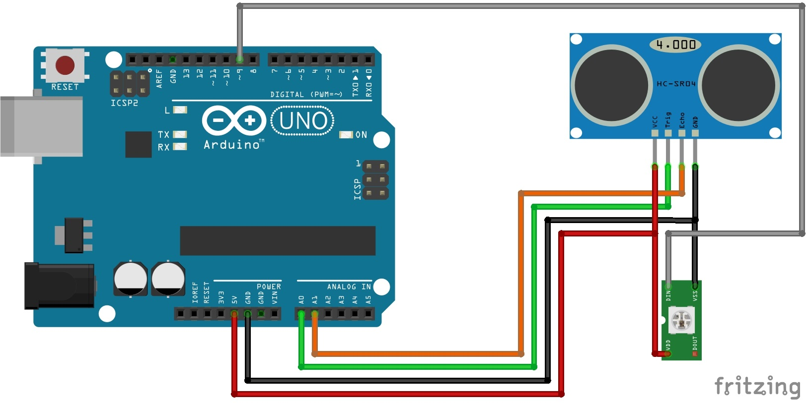

#Sample Software for Pan & Tilt Unit

## Requirements:
- Fully assembled Pan & Tilt Unit
- Arduino UNO (or similar)
- Ultrasonic Sensor Module (eg 1616245)
- RGB-LED WS2812

## Schematic:

   
Figure S1

###RGB-LED WS2812
DIN 		  → 9  
DOUT		  → empty 
VSS(VCC): → 5V 
VDD(GND):	→ GND  

###HC-SR04
Trig		→ A0 
Echo		→ A1 
VCC	  	→ 5V 
GND		  → GND 

##Software:

###“US-Demo”:

####**Description:**

The demo shows how the MAKERFACTORY Robobug can start walking automatically and avoid obstacles with help of an ultrasonic sensor HC-SR04.

####**Plug in:**

After plugging in the power supply, the Robobug gives a melody and waits for the start signal.
####**Start:**

Press the button T1 on the locomotion controller board. The Robobug gets up on its feet and starts walking in a straight direction.
####**Measuring:**

The head turns frequently from left to right, so the ultrasonic sensor continuously measures the distance to all obstacles in a range of 60° (30° left and 30° right) and the RGB LED blinks in blue and green.

####**Detect obstacle with distance < 60cm:**

The RGB LED turns red and the Robobug turns around until there is no other obstacle nearer than 90cm. 

####**Detect obstacle with distance < 30cm:**

The RGB LED turns red and the Robobug walks backwards (=escape behavior). After that, it turns around until there is no other obstacle nearer than 90cm. 

###Parameters:
||||
|:---:|:---:|:---:|
|**PARAMETER**|**Description**|**Default**|
|SERVO_TILT_PIN|Servo Tilt Pin|SU1|
|SERVO_PAN_PIN|Servo Pan Pin|SU2|
|WS2812_PIN|RGB-LED-Pin|SU3	(PIN 9)|
|SR04_TRG_PIN|Ultrasonic Trigger Pin|A0|
|SR04_ECHO_PIN|Ultrasonic Echo Pin|A1|
||||
|PAN_CENTER|Lower value ⇒  head goes left|100|
|TILT_CENTER|Lower value ⇒  head goes up|95|
|PAN_SCANDEG|Scan Degree (Degrees from center)|30|
|COLLISION_THRESH|Threshold for obstacles to turn|60|
|COLLISION_THRESH_FREE|Threshold for obstacles to escape|30|
|BASIC_DELAY|Basic delay to move backwards|1500|
|MIN_RND_DELAY|Min random delay to move backw.|500|
|MAX_RND_DELAY|Max random delay to move backw.|2000|
|MOVE_SPEED|Basic movement speed|20|

###“US-Following”:

####**Description:**

The demo shows how the MAKERFACTORY Robobug can follow obstacles (eg your hand) with help of an ultrasonic sensor HC-SR04. 

####**Plug in:**

After plugging in the power supply, the Robobug gives a melody and waits for the start signal.

####**Start:**

Press the button T1 on the locomotion controller board. The Robobug gets up on its and starts measuring

####**Measuring:**

The Robobug tries to keep the distance of any obstacle between 10 and 20 cm. If the obstacle moves closer to the Robobug’s head, the RGB-LED turns red and the roboter moves backwards. If the obstacle moves away, the LED turns blue and the robobug will follow the obstacle until the distance is less than 20 cm again. And if the nearest obstacle’s distance is higher than 60cm, the Robobug stops walking.

||||
|:---:|:---:|:---:|
|**PARAMETER**|**Description**|**Default**|
|SERVO_TILT_PIN|Servo Tilt Pin|SU1|
|SERVO_PAN_PIN|Servo Pan Pin|SU2|
|WS2812_PIN|RGB-LED-Pin|SU3	(PIN 9)|
|SR04_TRG_PIN|Ultrasonic Trigger Pin|A0|
|SR04_ECHO_PIN|Ultrasonic Echo Pin|A1|
||||
|DIST_MIN|Minimum Distance in cm|10|
|DIST_MAX|Maximum Distance in cm|20|
|DIST_STOP|Max Distance for STOP|60|
