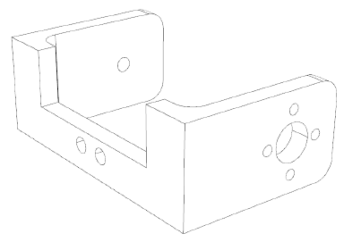

#Pan unit

Optionally, an additional servo can be purchased, and the robot can be extended by a pan unit (swivel unit). The complete kit already includes an additional U-holder with accessoires. Sensors or faces, for example. can be mounted on this. Please also have a look at the additional download for the Robobug. In the download area there are various 3D printable files available to expand your robot. The Pan unit is mounted in the same way as the legs are. Figure 81 shows the fully assembled Pan unit on the robot.

The servos can then be controllers via a user board, e.g. via the Arduino&trade; UNO. The servo is connected to one of the pin headers SU1 to SU3.

   

#Tilt unit (3D-printable)

 

The 3D models can be printed with a standard FDM 3D printer with a minimum print area of ​​60 x 60 x 60 mm and in different combinations for different servos, sensors and head models. The 3D printed part “B1 PanMount” has to be attached to the pan bracket which is already included in the Robobug set. An additional MF-06HEX 6V-Servo drives the pan unit.

A unit always contains the following 3D components:

1x PanMount.stl  
1x Mount-Servo-xxx (xxx = servo type)  
1x Mount-Tilt-xxx-yyy (xxx = name of the application - yyy = servo type)  

##Files

The STL-Files can be downloaded [here](https://produktinfo.conrad.com/datenblaetter/1600000-1699999/001664151-up-01-en-3D_ROBOBUG_DESIGN_FILES.zip)

**Available components:**

B1 (Pan Mount) 
baseFile: PanMount.stl 
Holder for attaching the tilt unit to the pan unit. 

 

B2 (Holder MAKERFACTORY MF-05HEX 6V) 
ServoFile: Mount Servo MF-05HEX.stl 
Tilt servo mount for MAKERFACTORY Servo MF-05HEX 6V. 

 


B3 (Tilt Unit Maker for Servo MF-05HEX 6V) 
File: Mount Tilt Maker Short MF-05HEX.stl 
Tilt unit for MAKERFACTORY Servo MF-05HEX 6V. 
Short version with universal mounting holes. 

 

B4 (Tilt Unit Maker for Servo MF-05HEX 6V) 
File: Mount-Tilt-Maker-Long-MF-05HEX.stl 
Tilt unit for MAKERFACTORY Servo MF-05HEX 6V. 
Long version with universal mounting holes. 

 

B5 (JeVois Tilt Unit for servo MF-05HEX 6V) 
File: Mount-Tilt-JeVois-Camera-MF-05HEX.stl 
Tilt unit for MAKERFACTORY Servo MF-05HEX 6V. 
For attaching the JeVois computer vision camera. 
Link: http://jevois.org 
Conrad Part Number: 1693282 

 


B6 (Servo Holder HiTec HS81 / 82) 
File: Mount Servo-HiTec-HS81-82.stl 
Tilt servo mount for HiTec servo HS81 and HS82. 

 

B7 (Servo Holder Reely S3027) 
File: Mount-Servo-Reely-S3027MG.stl 
Tilt servo mount for Reely servo S3027. 

 

B8 (Tilt Unit Maker for Servo HiTec-HS81 / 82) 
File: Mount-Tilt-Maker-Short-HiTec-HS81-82.stl 
Tilt unit for HiTec Servo HS81 and HS82. 
Short version with universal mounting holes. 

 

B9 (Tilt Unit Maker for servo HiTec-HS81 / 82) 
File: Mount-Tilt-Maker-Long-HiTec-HS81-82.stl 
Tilt unit for HiTec Servo HS81 and HS82. 
Long version with universal mounting holes. 

 

B10 (JeVois Tilt Unit for servo HiTec-HS81 / 82) 
File: Mount-Tilt-JeVois-Camera-HiTec-HS81-82.stl 
Tilt unit for HiTec Servo HS81 and HS82. 
For attaching the JeVois computer vision camera. 
Link: http://jevois.org 
Conrad Part Number: 1693282PixyCam 

 

B11 (Tilt Unit for Servo MF-05HEX 6V) 
File: Mount-Tilt-PixyCam-MF-05HEX.stl 
Tilt Unit for Maker-Factory Servo MF-05HEX 6V. 
For attaching the PixyCam computer vision camera. 
Link: https://pixycam.com 
PixyCam Conrad Part Number: 1364834PixyCam 

 

B12 (Tilt Unit for Servo HiTec-HS81 / 82) 
File: Mount-Tilt-PixyCam-HiTec-HS81-82.stl 
Tilt Unit for MAKERFACTORY Servo MF-05HEX 6V. 
For attaching the PixyCam computer vision camera. 
Link: https://pixycam.com 
PixyCam Conrad Part Number: 1364834 

 

B13 (Tilt Unit Pixy2 for Servo HiTec-HS81 / 82) 
File: Mount-Tilt-Pixy2-HiTec-HS81-82.stl 
Tilt unit for HiTec Servo HS81 and HS82. 
For attaching the Pixy2 computer vision camera. 
Link: https://pixycam.com 

 

B14 (Tilt Unit Pixy2 for Servo MF-05HEX 6V) 
File: Mount-Tilt-Pixy2-MF-05HEX.stl 
Tilt Unit for Maker-Factory Servo MF-05HEX 6V. 
For attaching the Pixy2 computer vision camera. 
Link: https://pixycam.com 

 

B15 (Tilt Unit Head for Servo MF-05HEX 6V) 
File: Mount-Tilt-Ultrasonic-SF04-Mouth-MF-05HEX.stl 
Head for mounting an HC-SR04 ultrasonic sensor, mouthpiece and a MAKERFACTORY servo MF-05HEX 6V. 
Ultrasonic sensor: eg Conrad order number 1616245 

 

B16 (Tilt unit head for servo MF-05HEX 6V) 
File: Mount-Tilt-Ultrasonic-SF04-MF-05HEX.stl 
Head for mounting an HC-SR04 ultrasonic sensor and a MAKERFACTORY servo MF-05HEX 6V.  
Without mouth. 
Ultrasonic sensor: eg Conrad Order number 1616245 

 

B17 (Tilt unit head for servo MF-05HEX 6V) 
File: Mount-Tilt-Ultrasonic-SF04-Mouth-Nose-MF-05HEX.stl 
Head for mounting a HC-SR04 ultrasonic sensor, mouth, nose and a MAKERFACTORY servo MF-05HEX 6V. 
Ultrasonic sensor: eg Conrad Order number 1616245 

 

B18 (Tilt unit head for Servo HiTec-HS81 / 82) 
File: Mount-Tilt-Ultrasonic-SF04-Mouth-HiTec-HS81-82.stl 
Head for mounting an HC-SR04 ultrasonic sensor, mouthpiece and a HiTec Servo HS81 or HS82. 
Ultrasonic sensor: eg Conrad Order number 1616245 

 

B19 (Tilt unit head for Servo HiTec-HS81 / 82) 
File: Mount-Tilt-Ultrasonic-SF04-HiTec-HS81-82.stl 
Head for mounting an HC-SR04 ultrasonic sensor and a HiTec Servo HS81 or HS82. 
Without mouth. 
Ultrasonic sensor: eg Conrad Order number 1616245 

 

B20 (Tilt unit head for Servo HiTec-HS81 / 82) 
File: Mount-Tilt-Ultrasonic-SF04-Mouth-Nose-HiTec-HS81-82.stl 
Head for mounting an HC-SR04 ultrasonic module with mouth and nose. 
Attached to a HiTec Servo HS81 or HS82. 
Head for mounting a HC-SR04 ultrasonic sensor, mouth, nose and a HiTec Servo HS81 or HS82. 
Ultrasonic sensor: eg Conrad Order number 1616245 

 

B21 (accessory) 
File: Mouth.stl 
Can be used in combination with the Tilt Unit Head. 

 

B22 (accessory) 
File: Nose-Knop.stl 
Can be used in combination with the Tilt Unit Head. When printed with transparent filament, a WS2812 LED can be glued behind the nose. Of course, another LED can be used as well.  

 

##Assembling:

###Needed mounting material:

**Servo disks** 
2x M2x8 
2x M2 nut 
**Servo mounting** 
2x M3x12 
2x M3 nut 
**Tilt mounting** 
1x M3x12 
1x M3 nut 
**Pan holder** 
3x M3x6 
3x M3 nut 
2x 2.9 x 13mm tapping or plastic screw 

 
 
 
 

The RGB LED WS2812 and the ultrasonic sensor HC-SR04 or SR05 can be glued to the mountings and connected to the controller board of the RoboBug. With this unit, you already have a friendly-looking robot with ultrasonic rangefinder, for example to avoid obstacles.
The RGB LED could for example display the battery charge level with changing the color from green to red.
