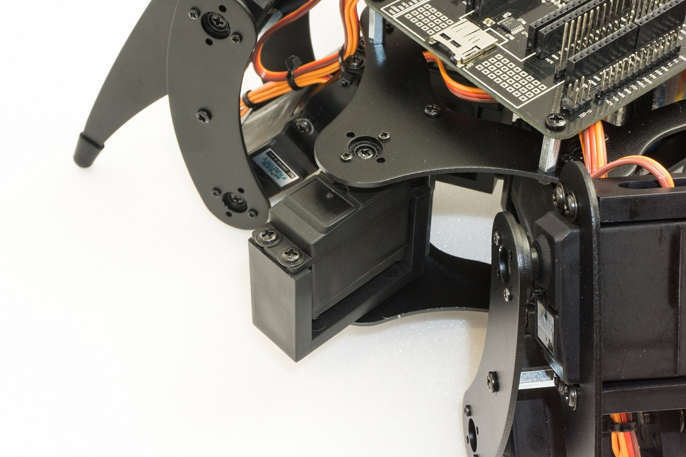

#Pan unit

Optionally, an additional servo can be purchased, and the robot can be extended by a pan unit (swivel unit). The complete kit already includes an additional U-holder with accessoires. Sensors or faces, for example. can be mounted on this. Please also have a look at the additional download for the Robobug. In the download area there are various 3D printable files available to expand your robot. The Pan unit is mounted in the same way as the legs are. Figure 81 shows the fully assembled Pan unit on the robot.

The servos can then be controllers via a user board, e.g. via the Arduino&trade; UNO. The servo is connected to one of the pin headers SU1 to SU3.

   
**Figure 81**
