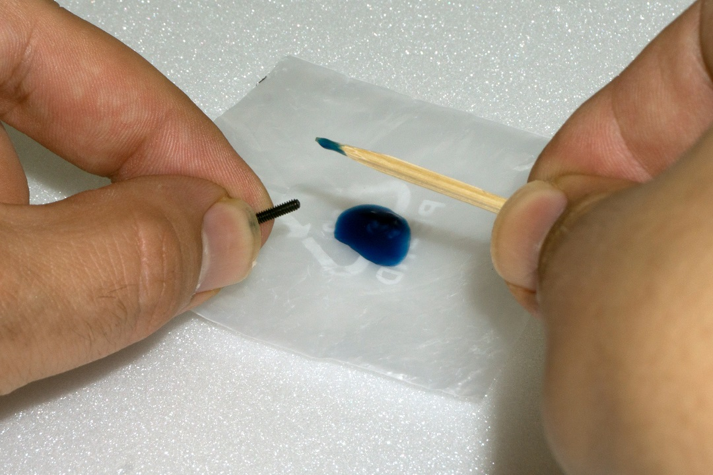

# Preparatory work
&rarr; Before the robot is assembled, some parts are prepared. This makes the actual assembly easier and faster.

## Application of the screw locking lacquer
In the following instructions, some screws should optionally be secured with a screw lock. This pointed out accordingly in the text. We recommend that you only apply the screw lock after the robot has been completely assembled and calibrated. Afterwards the screws to be secured are remlved again and provided with safety laquer. When assembling and calibrating the legs, it might be necessary to loosen them againe for adjustment tasks.

   
**Figure 2**

   
**Figure 3**

The easiest way to apply the screw lock adhesive is to apply a lager drop of the screw lock onto a base  (e.g., screw set). With the help of a toothpick or a small screwdriver, the screw lock can be proportionally applied to the thread. Do not use too much screw lock, a small drop is sufficient.

## Ball bearings and cylindrical pins
The leg servos are additionally stabilised by ball bearings with pressed-in cylindrical pins. This significantly reduces the mechanical load on the servos and significantly increases the service life of the servos. The ball bearings are supplied pre-assembled. If a pin is pushed out of the ball bearing during assembly, it can be pushed back again. If the pin is no longer firmly seated in the ball bearing, you can solve the problem with a small trick. Notch the pin at the point where it sits in the ball bearing with a side cutter, see picture 4.

   
**Figure 4**

Then push the pin back into the ball bearing (if necessary, carefully knock it in with a small hammer). Figure 5 shows the ball bearing with the cylindrical pin.

   
**Figure 5**

&rarr; Brown marks on the ball bearing are not rust! They represent grease and glue, which are used with the assembly of the two components in the manufacturing. You can remove these residues simply with alcohol (spirit).

## Power Supply
In assembling the Robobug you will need the battery for the power supply, in order to be able to move the leg servos in the middle position, to align the legs and later to install the firmware, which is responsible for running the robot in the next work steps. For all this work, the Robobug needs a power supply. The right power supply is crucial for the safe and trouble-free operation of the Robobug. The Robobug is designed for a NiMH battery with 5 cells and a capacity between 3500 - 5000 mAh. We recommend using the optionally available rechargeable battery. This can be used directly with the Robobug without soldering. Prepare your own battery The "Hexapod Robobug" complete set comes with a type XT30 battery plug. This is soldered to the battery selected by you. The cable length between battery and plug must not exceed 20 cm! For the connection cable, we recommend using a highly flexible silicone cable with a cross-section of between 2 and 2.5 mm². Pay attention to the polarity (plus/+ and minus/-), and that no short circuit is caused by soldering. In the event of a short-circuit, rechargeable batteries can emit a lot of current, which can lead to burns and fire damage as well as to dangerous injuries. An explosion of the battery is also possible! The ready-made battery is provided with a battery shrink tube. This way the battery looks clean at the end of the soldering work and indicates that there is no danger of a short circuit. In figure 7 you can see how the battery is plugged into the Robobug. The plug is protected against reverse polarity and cannot therefore be plugged in the wrong way.

### Prepare your own battery
The "Hexapod Robobug" complete set comes with a type XT30 battery plug. This is soldered to the battery selected by you. The cable length between battery and plug must not exceed 20 cm! For the connection cable, we recommend using a highly flexible silicone cable with a cross-section of between 2 and 2.5 mm². Pay attention to the polarity (plus/+ and minus/-), and that no short circuit is caused by soldering.
!!! Caution
    In the event of a short-circuit, rechargeable batteries can emit a lot of current, which can lead to burns and fire damage as well as to dangerous injuries. An explosion of the battery is also possible!
The ready-made battery is provided with a battery shrink tube. This way the battery looks clean at the end of the soldering work and indicates that there is no danger of a short circuit. In figure 7 you can see how the battery is plugged into the Robobug. The plug is protected against reverse polarity and cannot therefore be plugged in the wrong way.

   
**Figure 6**

   
**Figure 7**

## Installation of the software and firmware
The software packages, firmware and tools required for the "Hexapod Robobug" are available online as a download package. This package is updated and extended regularly. Please check occasionally whether a new version or useful extensions are available. Open your web browser and navigate either via our [shop website](https://www.conrad.com) to the product page of the "Hexapod Robobug" complete set, or visit our [download centre](https://www.conrad.com/downlods). directly. Here you can download the package "001664151-up-01-en-DOWNLOAD_BUNDLE_Vx_x" (x_x is the version of the package). The highest version number corresponds to the latest version! Unpack the downloaded ZIP file on your hard disk.
### Here is a short explanation of the included folders:
- "Arduino"  Here is a text file with the download link for the software Arduino™ IDE included.   This is needed, for example, to install the firmware without an updater.
- "Datasheets" Data sheets and sketches
- "Driver" Driver for the FTDI USB chip
- "Library demos"  Contains the Arduino library, demo's and the Locomotion firmware as a ZIP file. Will be installed in the Arduino IDE.
- "Schematic" Schematic of the Hexapod Robot Board as PDF file
- "Terminal" Calibration software for setting the Hexapod
