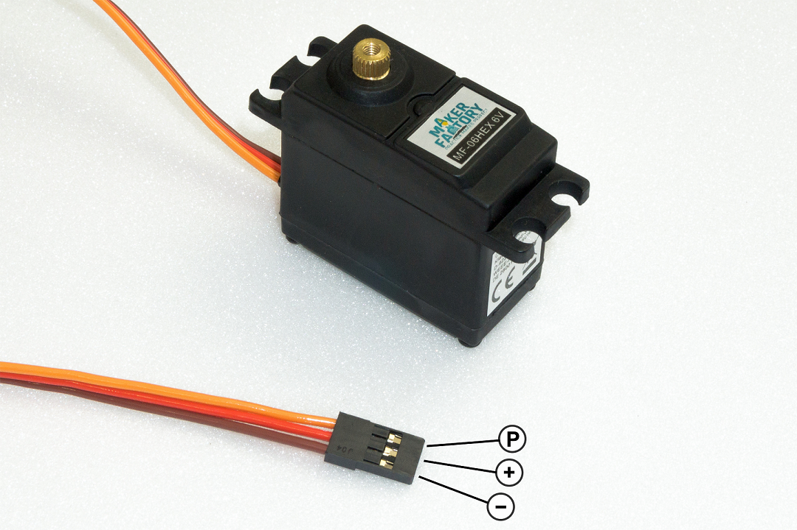
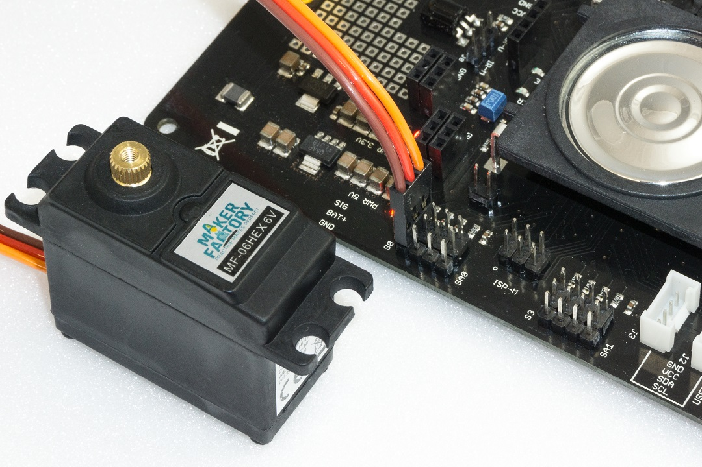
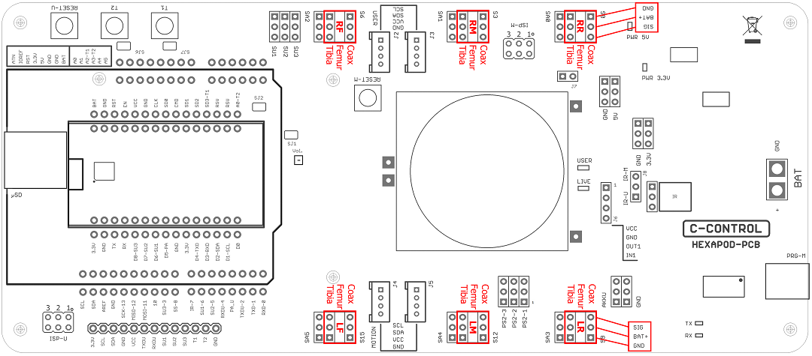
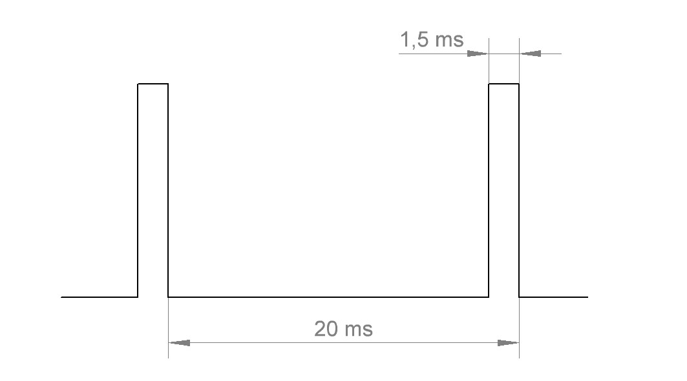

# Preparing the leg servos
Before you install the leg servos, you must move them to the centre position. This means moving the servos to the mechanical middle position using the Hexapod Robot Board and the "ServoCenter" program. This is the starting position for assembly. First unpack all 18 servos; then straighten all connecting cables. Pin assignment:   

| Labelling in Figure 15 | Function | Imprints on PCB |
| :---|:---|:---|
| P | Control pulse | SIG |
| + | Positive pole/+ | BAT |
| - | Negative pole/- | GND |

   
**Figure 15**

To set the leg servos, transfer the "ServoCenter" programme (located in the "Locomotion" directory) to the Hexapod Robot Board. The programme automatically moves the servos from "S0" to "S17" to the middle position. Connect the servos to the pin headers as shown in the figure (pay attention to the polarity!). All servo connections (S0 to S17) of the robot board are controlled with a pulse width of 1500 μs. At this point you do not have to connect all 18 servos to the Hexapod Robot Board at the same time. In practice, it has proven to be much easier and faster to use only one connection (e.g., S0) and then move one servo after the other to the middle position. The brown wire of the servo cable points to the edge of the board. The board is also labelled SIG (pulse), BAT+ (+), GND (-). 

&rarr; The battery must be connected for this procedure!

   
**Figure 16**

   
**Figure 17**

Figure 17 shows the pin headers to which the servos are connected.

&rarr; The pin strips labelled SA0 to SA5 do not carry a control signal. This connection remains unassigned and can later be used for proper extensions such as leg contact sensors.

The joint details are given anatomically in Latin and have the following meaning:   

- Coxa = hip   
- Femur = thigh    
- Tiba = leg   

The connections are also indicated in Figure 17 with the leg name as an abbreviation:   

- RR = Right rear leg ("Right Rear")   
- RM = Right Middle leg ("Right Middle")   
- RF = Right front leg ("Right Front")   
- LR = Left rear leg ("Left Rear")   
- LM = Left middle leg ("Left Middle")   
- LF = Left front leg ("Left Front")   

&rarr; Leave the programme on the Hexapod Robot Board until the robot is completely assembled. If you accidentally twist a servo mechanically during assembly, you can plug it in again and align it. If the servo is turned from the middle position during installation, this has a negative effect on the running characteristics. This can also damage the servo and the mechanics. Disconnect the robot board from the power supply in case you won't be using it for a long time to avoid accidental short circuits

**Functional description of a servo**   
Servos have electronics, a motor and a potentiometer. The potentiometer picks up the mechanical position of the servo and forwards it to the servo electronics. The electronics in the servo compares the given position (nominal value, in our case the pulse width given by the locomotion controller) with the pulse width of the servo electronics (set via the potentiometer, actual value). If there is a difference between the two pulse widths, the servo electronics regulates the motor to the target position. The graphic illustrates the pulse/pause ratio required to control a servo. In this case, the pulse has a length of 1.5 ms = 1500 μs, which corresponds to the centre position of the servo. A servo receives as control signal a positive pulse with a pulse width between 500 μs (0.5 ms) and 2500 μs (2.5 ms). The total period duration of the control signal is 20 ms. When the servo is in the middle position, the pulse width is 1500 μs (1.5 ms). If the pulse width is less than 1.5 ms, the servo rotates in one direction. If the pulse width is greater than 1.5 ms, it rotates in the other direction. The angle of rotation is proportional to the pulse width, i.e. the longer or shorter the pulse, the more or less the servo rotates in the corresponding direction. 

   
**Figure 18**
