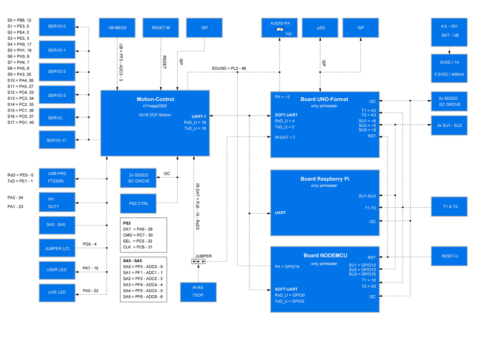

#Schematic system overview (block diagram)

The diagram shows schematically the internal wiring and the interaction of the individual components of the robot board and the servos as an aid for programming.

