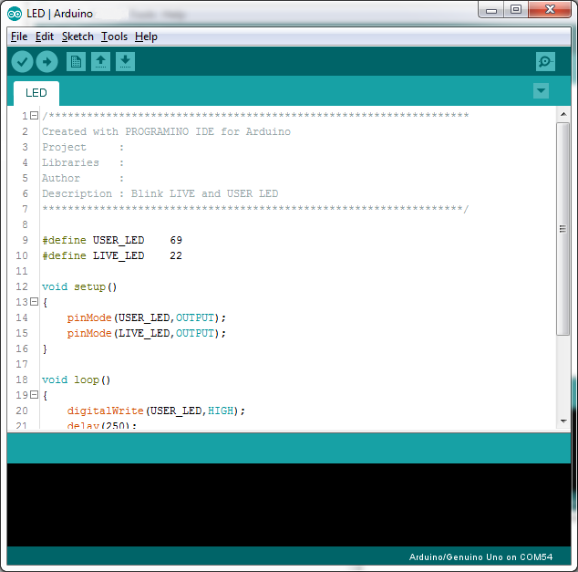
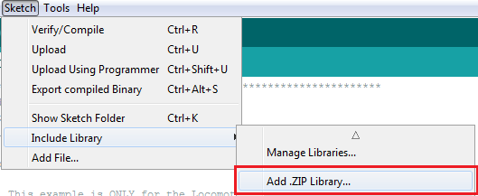
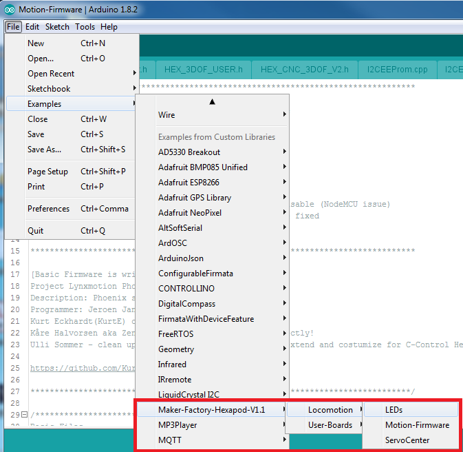
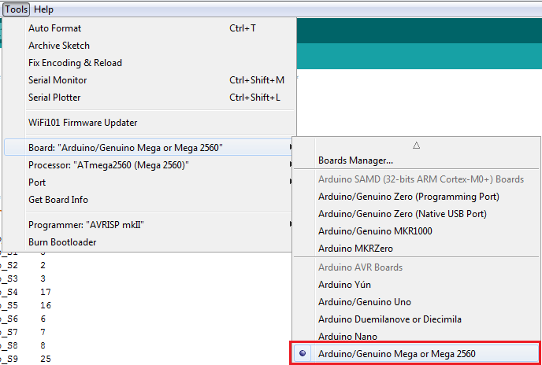
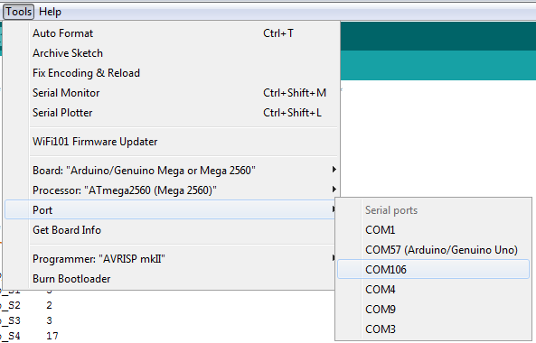
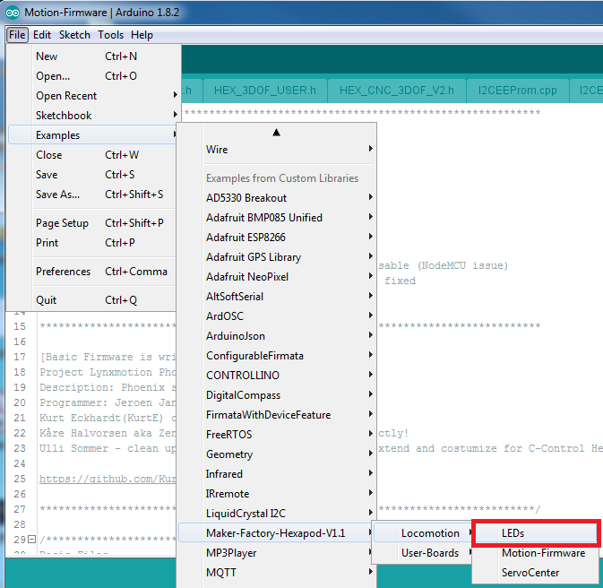

# Transferring the Firmware
On delivery, no firmware is installed on the Hexapod Robot Board. The firmware must first be transferred during initial commissioning. This is done via the Arduino IDE. The following description shows you the procedure for transferring the firmware. In the following chapters you will transfer different programmes to the Hexapod Robot Board. The procedure is identical except for the selection of the respective program.

   &rarr;  When transferring the firmware, the Hexapod Robot Board must be connected to the power supply (battery)! Make sure that the battery is fully charged before transferring the firmware or programmes.

## Installing the driver
Connect the "PRG-M" port of the Hexapod Robot Board to a free USB port on your computer. Windows will now attempt to install a new driver. Typically, Windows will automatically download and install the drivers from the Internet, since the driver for the "FTDI" USB bridge chip used is available in the Windows driver download (the computer must be connected to the Internet for this to work). If this method does not work, refer to the driver manually during installation. The driver is located in the unpacked download bundle, in the "Driver" directory. After installing the driver, check in the device manager whether the driver for the Hexapod Robot Board has been installed and which COM port number has been assigned. Then select them in the Arduino IDE. You can also download the drivers directly from [FTDI Chip](http://www.ftdichip.com).

## Install Arduino IDE
You can download the latest version of the Arduino IDE from [Arduino](https://www.arduino.cc). The Arduino IDE is available as "installer version" and as "ZIP archive". Both versions can be used. With the installer version, you install the Arduino IDE as you would install any other programmes. With the ZIP version, you must unpack the ZIP archive to the desired location on your computer after the download. Then start the programme by double-clicking on the file "arduino.exe".

   &rarr; The current firmware version was developed with Arduino version 1.8.3. If there are problems with newer versions, download an older version of the Arduino IDE from [Arduino](https://www.arduino.cc) and transfer the firmware with it. Also familiarize yourself with the board and its connectors. An overview of the board can be found in Chapter 19 Figure 79.

## Setting up Arduino IDE
Start the Arduino IDE and follow the instructions in this manual.

   
**Figure 8**

Now install the Hexapod library. It can be found in the download bundle under
"\Library-Demos\Maker-Factory-Hexapod-V1.1.zip". Select the menu item "Sketch\Include Library\Add .ZIP Library..." in the Arduino IDE.

   &rarr; If you update the library later, you have to delete the old library first, otherwise the Arduino IDE will report an error!

   
**Figure 9**

After you have installed the library, you will find two folders named "Locomotion" and "User-Boards" in the menu item "\File\Examples\Maker-Factory-Hexapod-Vx.x". The folder "Locomotion" contains programmes for the Locomotion controller, which is fixed on the Hexapod Robot Board and is responsible for the operation. The folder "User-Boards" contains programmes for the Arduino compatible user boards like Arduino UNO and NodeMCU.

   
**Figure 10**

Select the microcontroller used under the menu item "Tools\Board\Arduino/Genuino Mega". The locomotion controller is compatible with the Arduino Mega 2560.

   
**Figure 11**

Select the COM port under "Tools\Port" that was assigned to the Hexapod Robot Board during driver installation.

   
**Figure 12**

To test if everything works, transfer the sample programme "\User-Board\Locomotion\ LEDs". After successful transmission, the programme causes the blue "LIVE-LED" and the red "USER-LED" to flash alternately.

   &rarr;To transfer the programmes, the battery must be plugged into the Hexapod Robot Board!

After selecting the "LEDs" programme (also called Sketch in Arduino) a new Arduino IDE window opens with the "LEDs" Sketch.

   
**Figure 13**

With the "arrow to the right" symbol (see picture 14) in the menu you transfer the programme to the Hexapod Robot Board. Alternatively, you can also use the shortcut "CTRL+U".

   
**Figure 14**

This procedure applies to all programmes to be transferred (called sketches in the Arduino IDE) that are intended for the locomotion controller. For the user board samples, you only change the applied user board in use and the "COM-Port".

   &rarr;  Please read the respective initial comment in the source code of the examples before transferring. This contains important information about the program!

If the transfer does not work, please check your settings for board and connection and also check if the board has been entered and installed correctly in the device manager and if the power supply is connected. Here you can find more information about installing the Arduino IDE from [Arduino](https://www.arduino.cc/en/Guide/Windows). Leave the board plugged in for the next step, as you will need to move the leg servos to the centre position in this step.
