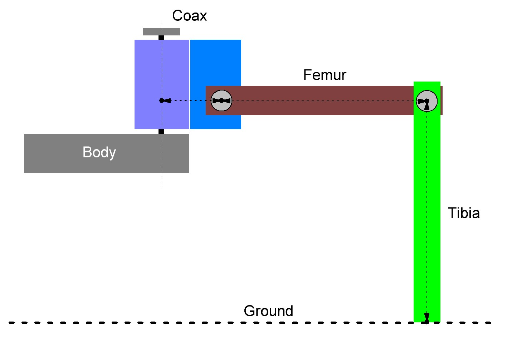

# Transferring the firmware  
After	you	have	finished	the	mechanical	assembly	of	the	robot,	the	"Locomotion	Firmware"	can	be	installed	on	the	robot	board.	This	is	responsible	for	the	running behaviour of the robot.  

**Check the following before transferring and switching on the robot board:**  

- Are all servos connected correctly (polarity)?   
- Are all servos mechanically in the middle?    
- Is the Gamepad controller connected?   
- Is	the	battery	sufficiently	charged?    
- Is there enough space available for the robot, even in the event of a malfunction?   

Now connect the battery to the robot board, if not already done. Connect the robot board (connection "PRG-M") to your computer as already done. Then select in the Arduino IDE in the Hexapod examples the programme "Motion Firmware" (located under "Locomotion"). Transfer the programme to the robot board as usual.
 
