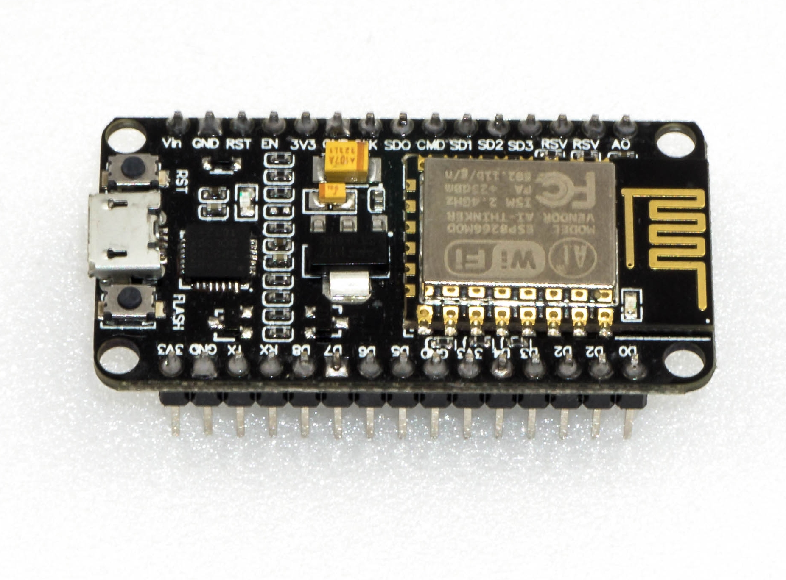

#Using user boards
The robot board can be equipped with different user boards to extend the functionality. Possible user boards are e.g., Arduino UNO, NodeMCU or compatible boards. These can be plugged directly onto the robot board. With the software library described in the next chapter you can send control commands from the user board to the locomotion controller or read values from the locomotion controller. More about this later in the next chapter "Demo Programmes".

## Arduino-UNO
The two outer longer pin headers are used for a compatible user board "Arduino-UNO". All pins are led out at socket connectors next to it. This allows you to easily access the pins of the board. The pin assignment is printed on the board next to the pin headers and corresponds to that of the board used. Have a look at the software examples.

## NodeMCU
The popular WiFi board with the designation "NodeMCU" and the employed ESP8266 WiFi chip can be used on the inner slot as a user board. Also, here all pins are led out on the adjacent socket strips, which makes experimenting easier. Have a look at the software examples.

##SBC (Single Board Computer)
A Raspberry Pi 2 or 3 or any other SBC can be connected to the pin header next to the "ISP-U" connection. It is also possible to use radio modules or Bluetooth® modules as user boards via this connection. This pin header should be regarded universal and represents an interface for proper extensions and developments.

##Arduino UNO
Plug an "Arduino UNO" board onto the robot board as shown in Figure 73. Proceed carefully and make sure that the longer pin strips, which are plugged into the sockets of the "Arduino UNO" board, are not bent.
Also, make sure that all pin header pins are plugged into the sockets of the "Arduino UNO" board.
It is possible to use almost all Arduino UNO compatible boards.
After plugging in the board, you can jump directly to the chapter "Demo Programmes".

##NodeMCU WiFi Board
The WiFi board called "NodeMCU" and the ESP8266 WiFi chip used can be used as a user board on the inner slot.
If you want to extend the robot board with WiFi, you can easily do so with the help of this user board. The examples already include programmes for the NodeMCU board that allow control view from a web browser.
Plug a NodeMCU board onto the Hexapod Robot Board as shown in Figure 74. Proceed carefully and make sure that the pin strips are not bent and that all pins are plugged in correctly.
After plugging in the board, you can jump directly to the chapter [Demo Programs](..demo_programs.md).

!!! Caution
    When buying, make sure that the distance between the pin strips is correct! There are two different versions on the market. One has a Silabs CP2102 as USB chip while the other version has a CH340G.
    The	version	with	the	CH340G	has	a	wider	pin	spacing	and	does	not	fit	into	the	robot board! The NodeMCU board to be used must have a pin strip spacing of 23 mm.

##Single-Board-Computer (SBCs) and other Boards
The robot board offers the possibility to mount an SBC like e.g., a Raspberry Pi 2/3 or compatible via board spacers. SBCs with a different hole spacing can be easily mounted with a self-made adapter board. Here the robot board offers enough space for proper extensions. The pin header shown next to the "ISP-U" connection is a universal connection port for SBC or your own extensions. For the wiring between the SBC and the robot board, it is best to use the so-called "jumpwire" (socket - socket).

## Pin description (see inscription below the pins in Figure 76):

|||
|:---|:---|
|3.3 V|3.3 V/DC Supply input for the internal level converters of the robot board (Connect 3.3 V from the SBC in this case). If you use a board with a level of 5 V, then connect 5 V instead of 3.3 V (always connect the respective supply voltage; the SBC then supplies the level converters of the robot board with the correct voltage).
|SCL|I²C clock line (connect SCL of the SBC here, the I²C bus is then available at sockets J2 and J3)
|SDA|I²C data cable (here connect SCL of the SBC, the I²C bus is then available at sockets J2 and J3)
|GND|Ground/GND (negative pole)
|VCC|Output +5 V/DC, 1000 mA from the voltage regulator, here you can connect the supply of the SBC
|TXDU|UART transmission line of the locomotion controller (connect the UART RxD of the SBC here)
|RXDU|UART receiver line of the locomotion controller (connect the UART TxD of the SBC here)
|SU1 - SU3|These connections lead directly to the pin header SU1, SU2, SU2. These pins can be used freely, e.g., for servos or digital signals.
|T1 - T2|These pins are connected to the buttons T1 and T2. The buttons are externally equipped with pull-up resistors and provide a high signal when they are not actuated. The pull-up resistors can be deactivated with the board jumpers SJ6 and SJ7.
|GND|Ground/GND (negative pole)

Figure 77 shows the robot and a Raspberry Pi 2 mounted on three 25 mm long circuit board spacers. The holes for mounting are already present in the robot board. The connection between the Raspberry Pi and the robot board was made using jumpwire connectors. The cables of the jumpers were placed under the Raspberry Pi to get a clean wiring.

!!! Info
    It's	possible	that	your	SBC	reacts	very	sensitively	to	voltage	fluctuations	and	safe	operation	is	not	possible	via	the	battery,	which	also	supplies	the	leg	servos.  In this case we recommend to supply the SBC via a small separate power bank. In practice, a battery capacity with a Powerbank of 2000 - 3000 mAh is	sufficient	to	supply	the	SBC	until	the	Hexapod	battery	is	empty.	Sometimes	it	is	also	sufficient	to	support	the	power	supply	directly	at	the	SBC	with	a	large	capacitor	of	2200	μF	(or	more).	 The reason for the unstable operation might come from a battery that is too small with high internal resistance, or from servos with very high current consumption or large current peaks.

