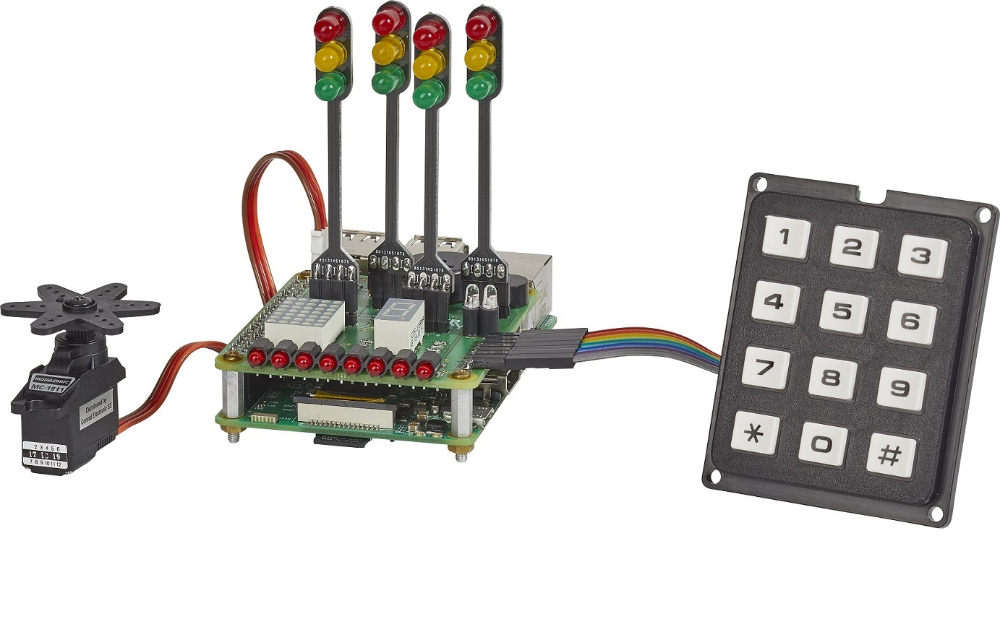
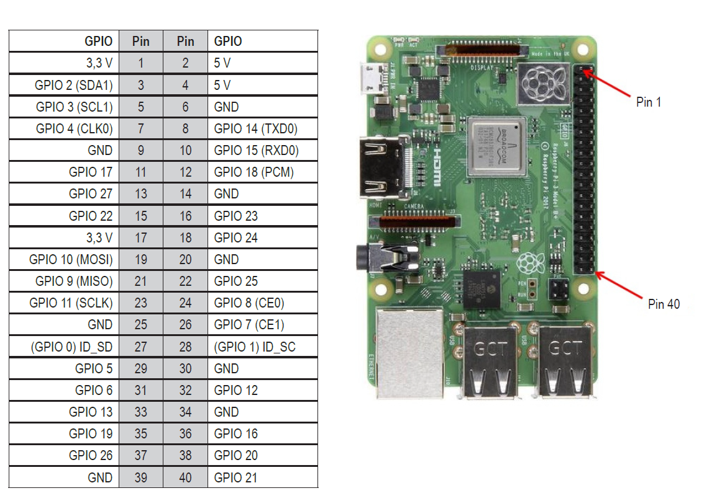
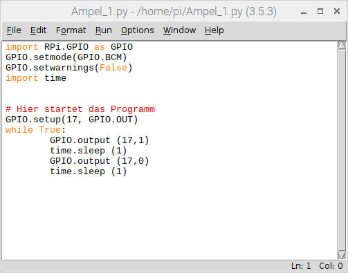

# PROGRAMMING LEARNING-PACKAGE FOR RASPBERRY PI®

This documentation describes the **learning package** from Makerfactory for learning Python.
This is a hat for the Raspberry Pi for people who want to learn programming.

## Board

The following picture shows the hat for the Raspberry Pi.

## Peripheral components

The learning package comes with a bunch of peripheral components which could be used for own projects. The usage of these components is described in the manual. The following table lists the components:

- Board 
- Spacers 
- 4 traffic lights 
- LED array with eight LEDs
- Keypad 
- 5 * 7 dot matrix display 
- Miniature buzzer 
- Seven segment display
- Two blue lights 
- Servo motor
- Piezo speaker 
- Switch 
- Push button 

## GPIO of Raspberry Pi

The package learns how to program all the components of the board in python. All components are connected to the GPIOs of the Raspberry Pi.

The following picture shows the GPIOs of the Raspberry Pi.

## Programming examples

There are 88 files of explaining how to program the learning package. 
Here the first one called "Ampel_1.pi":

!!! example
    There is one example project for Python which can be downloaded: 
    **Ampel_1.py** ([download here](../../source/raspberry/Ampel_1.py))

## Manual

There is an extract of the manual available here. The complete manual is delivered when buying the project.

!!! example
    There is one extract of the manual which can be downloaded: 
    **Manual** ([download here](../../source/raspberry/1893842_V1_0219_01_VTP_m_de_Leseprobe.pdf))

