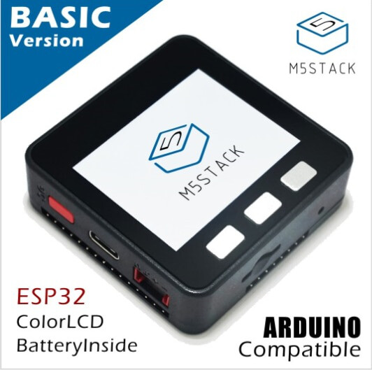
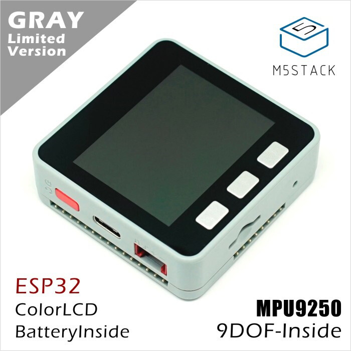
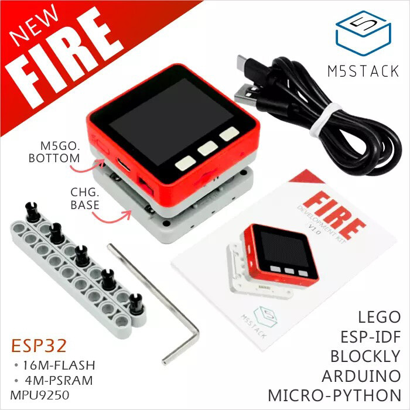
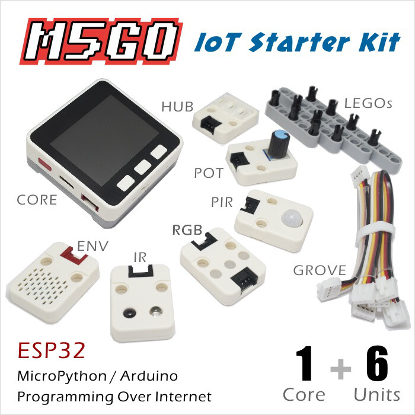
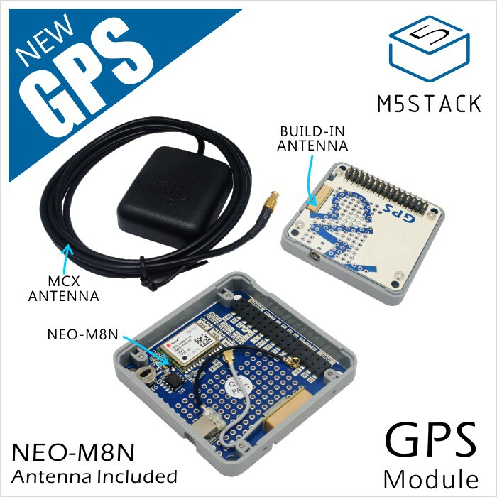
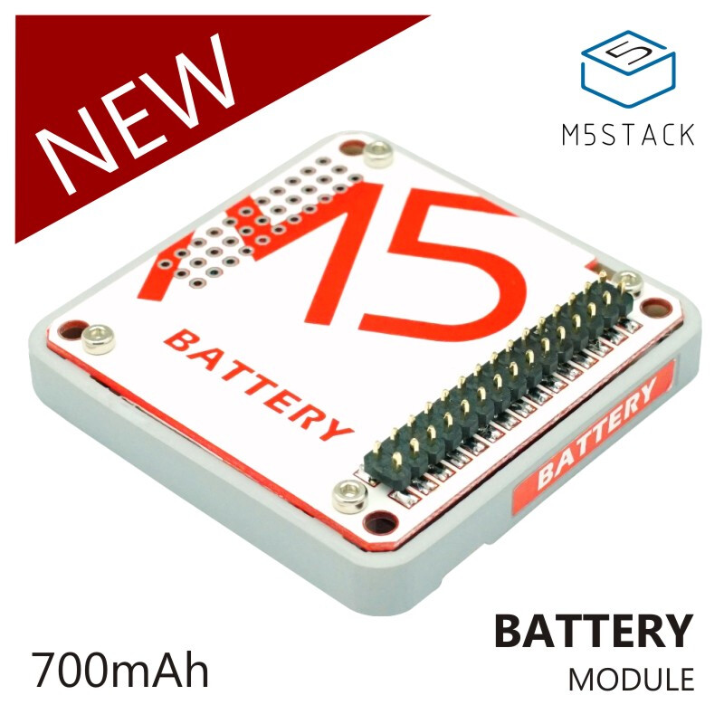
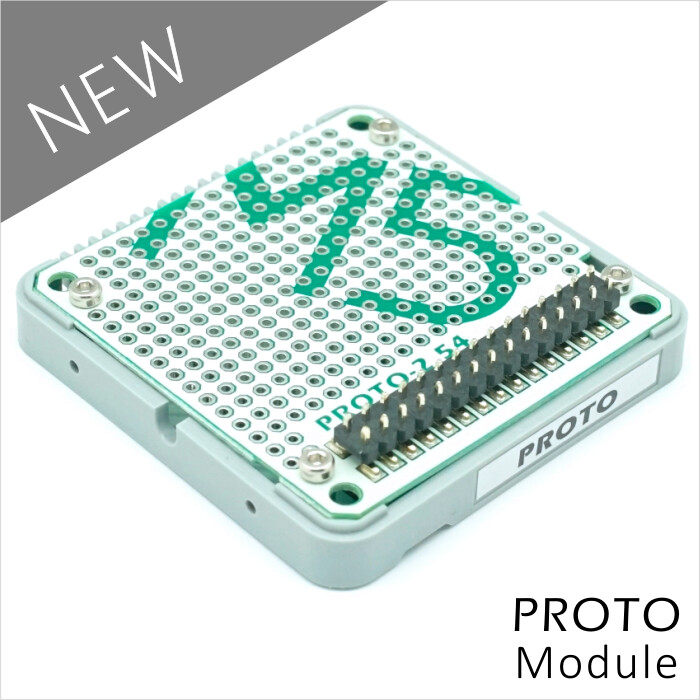
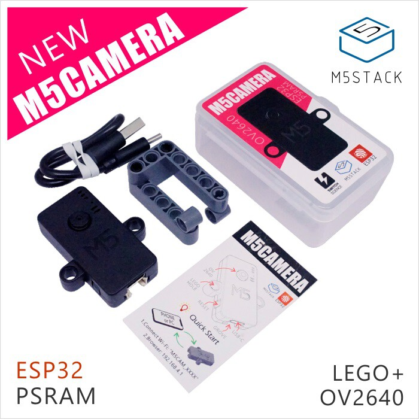
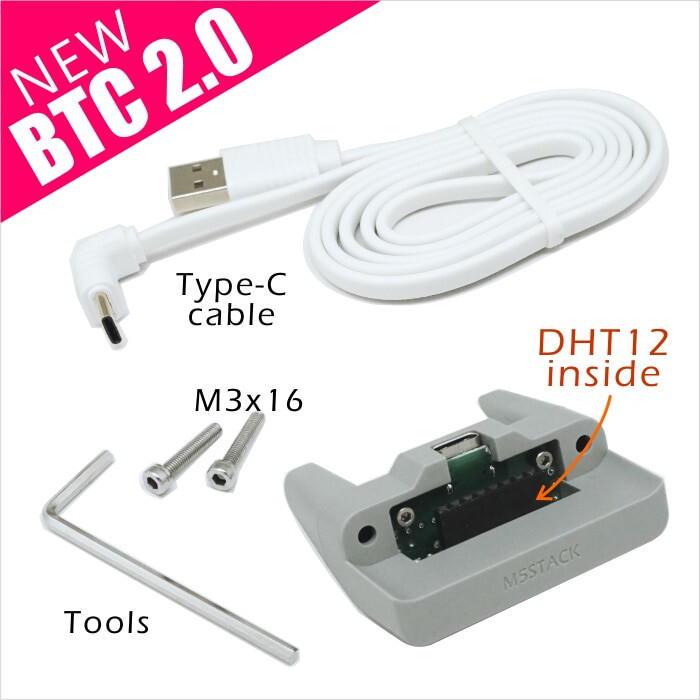

# M5Stack Products

### M5STACK Core

  

    
     
    [M5Core BASIC](/m5stack/core/black)
  

  

    
     
    [M5Core GRAY](/m5stack/core/gray)
  

  

    
     
    [M5Core FIRE](/m5stack/core/fire)
  

### M5STACK Kit

  

    
     
    [M5GO Kit](/m5stack/kit/m5go)
  

  

    
     
    [FACES Kit](/m5stack/kit/faces)
  

### M5STACK Module

  

    
     
    [GPS](/m5stack/module/gps)
  

  

    
     
    [BATTERY](/m5stack/module/battery)
  

  

    
     
    [PROTO](/m5stack/module/proto)
  

### M5STACK Unit

  

    
     
    [M5Camera](/m5stack/unit/m5camera)
  

### M5STACK Base

  

    
     
    [BTC](/m5stack/base/btc)
  

