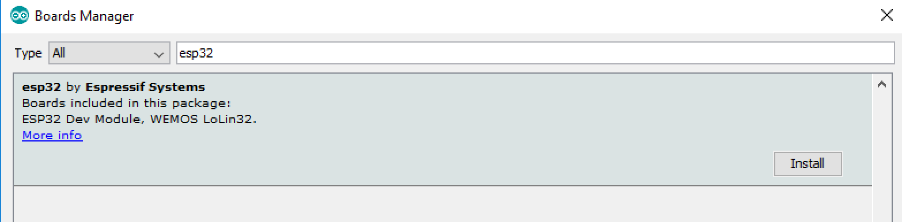

# Programming the ESP32

After a successful [installation](/install) of the Arduino IDE it's necessary to install the ESP32 as development board inside the Arduino. For this you have to register a new board manager.

## Register a new board manager

Start the Arduino IDE, open the Preferences window with *File > Preferences* in the menu bar.

    https://dl.espressif.com/dl/package_esp32_index.json

